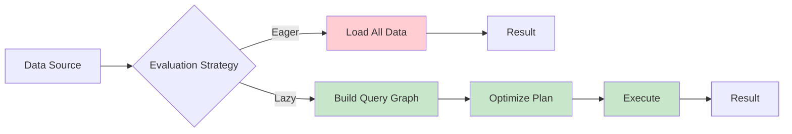
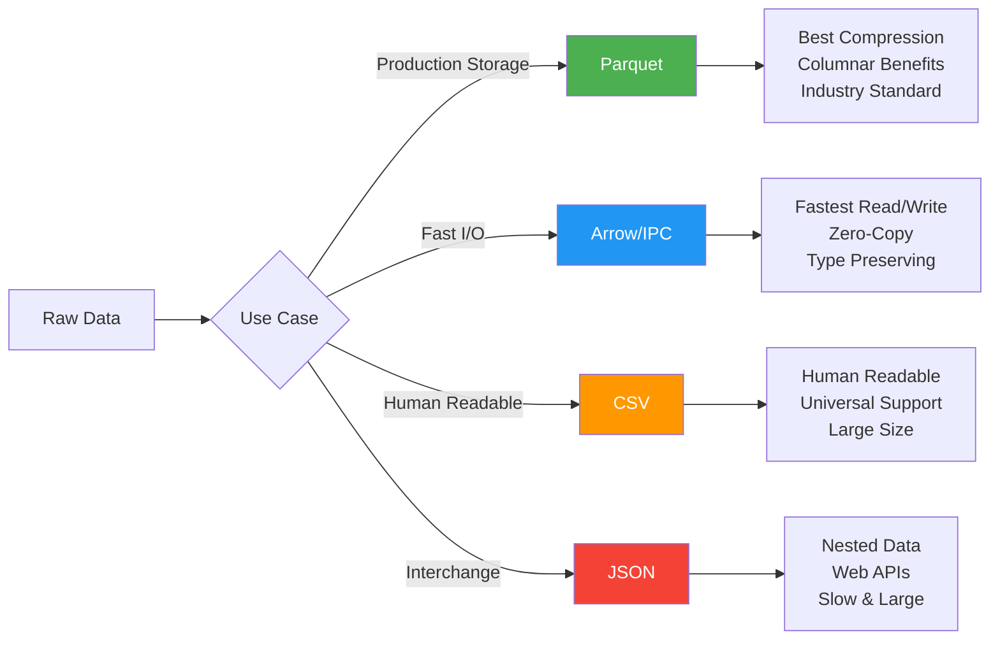
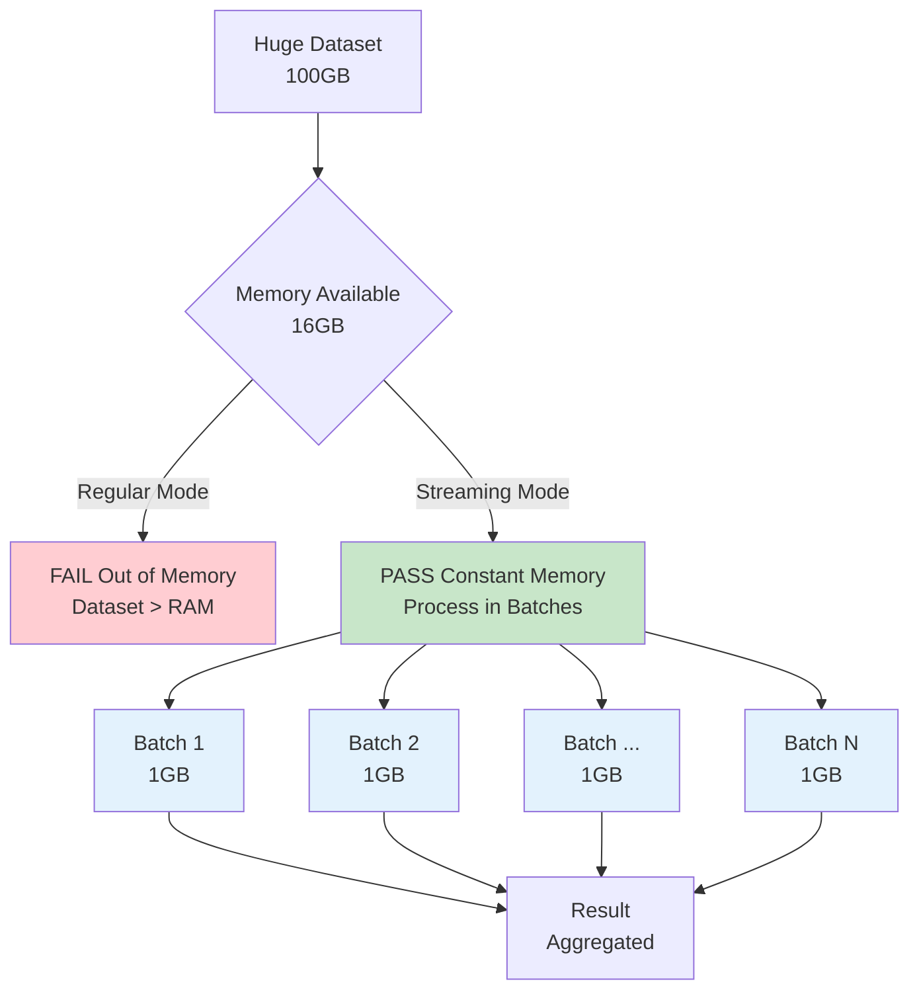
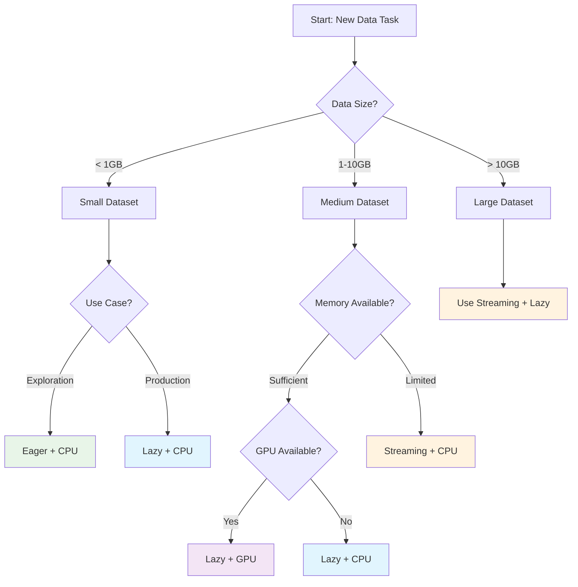

# Polars: The Complete Guide for Data Engineers and Scientists


This comprehensive guide covers practical Polars patterns, optimizations, and best practices for data professionals working with datasets of all sizes.

## Why Polars?

> "Come for the speed, stay for the API" - Polars Community

Built in Rust with Apache Arrow as its foundation, Polars delivers:

```
Performance Comparison vs pandas
┌─────────────────────────────────────────────────────────┐
│                    Processing Speed                     │
├─────────────────────────────────────────────────────────┤
│ pandas     ████████████████████████████████████████████ │
│ Polars     ████                                         │
│                                                         │
│            0s      5s     10s    15s    20s    25s      │
│                                                         │
│            Memory Usage                                 │
│ pandas     ████████████████████████████████████████████ │
│ Polars     ████████                                     │
│                                                         │
│            0MB    2GB    4GB    6GB    8GB   10GB       │
└─────────────────────────────────────────────────────────┘
```

**Key Benefits:**
- **PERFORMANCE: 10-100x performance improvements** over traditional tools
- **MEMORY EFFICIENCY** - uses up to 8x less memory than pandas
- **EXPRESSIVE API** that encourages functional programming
- **DUAL APIS** - Both eager and lazy APIs for different use cases
- **GPU ACCELERATION** support for compatible operations

## 1. Core Concepts: Understanding Polars Architecture

```mermaid
graph TD
    A[Raw Data] --> B[Series]
    A --> C[DataFrame]
    A --> D[LazyFrame]

    B --> E[1D Operations]
    C --> F[2D Operations]
    D --> G[Query Optimization]

    E --> H[Result]
    F --> H
    G --> I[collect()] --> H

    style B fill:#e1f5fe
    style C fill:#f3e5f5
    style D fill:#e8f5e8
    style G fill:#fff3e0
```

### Data Structures
```
┌─────────────────┬─────────────────┬─────────────────────┐
│     Series      │   DataFrame     │     LazyFrame       │
│  (1D column)    │ (2D table)      │ (deferred query)    │
│                 │                 │                     │
│ [1, 2, 3, 4]    │ ┌───┬───┬───┐   │ ┌─────────────────┐ │
│                 │ │ A │ B │ C │   │ │  Query Graph    │ │
│                 │ ├───┼───┼───┤   │ │                 │ │
│                 │ │ 1 │ x │ * │   │ │ filter() ────┐  │ │
│                 │ │ 2 │ y │ * │   │ │              │  │ │
│                 │ │ 3 │ z │ * │   │ │ select() ────┤  │ │
│                 │ └───┴───┴───┘   │ │              │  │ │
│                 │                 │ │ collect() ───┘  │ │
│                 │                 │ └─────────────────┘ │
└─────────────────┴─────────────────┴─────────────────────┘
     Immutable         Immutable        Optimized Execution
```

- **Series**: One-dimensional data (like a column)
- **DataFrame**: Two-dimensional data with labeled columns
- **LazyFrame**: Deferred computation graph for optimization

All structures are **immutable**, promoting functional-style operations and thread safety.

### Expressions: The Heart of Polars
Expressions are composable, optimizable, and reusable building blocks:

```python
# Expression example - works in select, filter, group_by contexts
expression = pl.col("sales").filter(pl.col("date") > "2024-01-01").sum()
```

## 2. Performance: Lazy vs Eager Evaluation



The lazy API provides **10-100x performance improvements** through query optimization:


```
Eager API (Immediate Execution)         Lazy API (Deferred Execution)
┌─────────────────────────────────┐    ┌─────────────────────────────────┐
│ df = read_parquet("huge.parquet") │    │ lf = scan_parquet("huge.parquet") │
│           ↓ LOAD ALL             │    │           ↓ SCAN METADATA       │
│ [████████████████████████████]   │    │ [▓▓▓░░░░░░░░░░░░░░░░░░░░░░░░░]   │
│                                 │    │                                 │
│ df = df.filter(col("x") > 10)    │    │ lf = lf.filter(col("x") > 10)    │
│           ↓ PROCESS ALL          │    │           ↓ ADD TO PLAN         │
│ [████████████████████████████]   │    │ [░░░░░░░░░░░░░░░░░░░░░░░░░░░░░]   │
│                                 │    │                                 │
│ result = df.select(["x", "y"])    │    │ lf = lf.select(["x", "y"])       │
│           ↓ PROCESS ALL          │    │           ↓ ADD TO PLAN         │
│ [████████████████████████████]   │    │ [░░░░░░░░░░░░░░░░░░░░░░░░░░░░░]   │
│                                 │    │                                 │
│                                 │    │ result = lf.collect()           │
│                                 │    │           ↓ OPTIMIZED EXECUTION │
│                                 │    │ [██████░░░░░░░░░░░░░░░░░░░░░░░]   │
└─────────────────────────────────┘    └─────────────────────────────────┘
    Memory: High, Speed: Slow             Memory: Low, Speed: Fast
```

### When to Use Each
```
┌─────────────────┬──────────────────┬─────────────────────┐
│   Eager API     │    Lazy API      │    Best For         │
├─────────────────┼──────────────────┼─────────────────────┤
│ PASS Interactive   │ PASS Production     │ Exploration      │
│ PASS Small data    │ PASS Large data     │ Production       │
│ PASS Debugging     │ PASS Complex ops    │ Development      │
│ PASS Immediate     │ PASS Optimization   │ Performance      │
└─────────────────┴──────────────────┴─────────────────────┘
```

### Performance Example
```python
# SLOW: Eager execution - processes entire dataset multiple times
df = pl.read_parquet("large_dataset.parquet")  # Load all data
df = df.filter(pl.col("value") > 100)          # Process all rows
result = df.group_by("id").agg(pl.col("value").mean())

# FAST: Lazy execution - builds optimized execution plan
result = (
    pl.scan_parquet("large_dataset.parquet")     # Just scan metadata
    .filter(pl.col("value") > 100)               # Will push down to file read
    .group_by("id").agg(pl.col("value").mean())
    .collect()  # Execute optimized plan once
)
```

## 3. File Format Optimization



```
File Format Performance Comparison (1M rows dataset)
┌─────────────────────────────────────────────────────────────────┐
│              Read Time    Write Time    File Size    Compression │
├─────────────────────────────────────────────────────────────────┤
│ CSV          ████████     ██████       ███████████  None         │
│ JSON         ████████████ ████████     ███████████████ None      │
│ Parquet      ███          ████         ████         High         │
│ Arrow/IPC    ██           ███          █████        Medium       │
└─────────────────────────────────────────────────────────────────┘
    0.0s      2.0s      4.0s  |  0-80MB  |  Winner: Arrow for speed
                              |          |  Winner: Parquet for size

Columnar vs Row Format Benefits
┌─────────────────────────────────────┐  ┌─────────────────────────────────────┐
│           Row Format (CSV)          │  │        Columnar (Parquet)           │
├─────────────────────────────────────┤  ├─────────────────────────────────────┤
│ Row 1: [Alice, 25, Engineer]        │  │ Names:  [Alice, Bob, Charlie, ...]  │
│ Row 2: [Bob, 30, Manager]           │  │ Ages:   [25, 30, 35, ...]          │
│ Row 3: [Charlie, 35, Director]      │  │ Roles:  [Engineer, Manager, ...]    │
│                                     │  │                                     │
│ To read Age column:                 │  │ To read Age column:                 │
│ FAIL Must read entire file             │  │ PASS Read only Age column              │
│ FAIL Parse all columns                 │  │ PASS Skip unnecessary columns          │
│ FAIL No compression benefits           │  │ PASS Column-specific compression       │
└─────────────────────────────────────┘  └─────────────────────────────────────┘
```

```python
# For archival storage (compression priority)
df.write_parquet("archive.parquet", compression="zstd")

# For fast reads (speed priority)
df.write_ipc("fast_access.arrow", compression="lz4")

# For partitioned datasets
df.write_parquet("partitioned_data", partition_by=["year", "month"])
```

## 4. GPU Acceleration with Fallback

GPU operations can be 5-50x faster for compatible operations:

```python
# Modern GPU engine configuration
from polars.lazyframe.engine_config import GPUEngine

# Lenient GPU usage (allows fallback)
lenient_gpu = GPUEngine(raise_on_fail=False)
result = query.collect(engine=lenient_gpu)

# Strict GPU usage (fails if unsupported)
strict_gpu = GPUEngine(device=0, raise_on_fail=True, memory_fraction=0.8)
result = query.collect(engine=strict_gpu)
```

## 5. Memory Optimization Through Data Types

Choosing optimal data types can reduce memory usage by 60%+:

```python
# Memory-optimized schema
optimized_schema = {
    "user_id": pl.UInt32,           # 4 bytes vs 8 bytes Int64
    "age": pl.UInt8,                # 1 byte vs 8 bytes
    "price": pl.Float32,            # 4 bytes vs 8 bytes Float64
    "category": pl.Categorical,     # Efficient for repeated strings
    "is_active": pl.Boolean,        # 1 bit vs 8 bits
    "timestamp": pl.Datetime("ms"), # Millisecond precision
}

df = pl.read_parquet("data.parquet", schema_overrides=optimized_schema)
```

## 6. Streaming for Out-of-Core Computation



```
Memory Usage: Regular vs Streaming Mode

Regular Collection                     Streaming Collection
┌─────────────────────────────┐       ┌─────────────────────────────┐
│ ████████████████████████████ │ 32GB  │ ████                        │ 4GB
│ ████████████████████████████ │       │ ████                        │
│ ████████████████████████████ │       │ ████  ← Process in batches  │
│ ████████████████████████████ │       │ ████                        │
│ ████████████████████████████ │       │                             │
│ ████████████████████████████ │       │ Available Memory: ████████  │
│ ████████████████████████████ │       │                             │
│ ████████████████████████████ │ OOM!  │                             │
└─────────────────────────────┘       └─────────────────────────────┘
   Loads entire dataset                  Constant memory usage
   Memory = Dataset size                 Memory = Batch size

Streaming Process Flow:
┌──────┐   ┌──────┐   ┌──────┐   ┌──────┐
│Batch1├──→│Batch2├──→│Batch3├──→│BatchN│
└──┬───┘   └──┬───┘   └──┬───┘   └──┬───┘
   ↓          ↓          ↓          ↓
 Process    Process    Process    Process
   ↓          ↓          ↓          ↓
┌──────────────────────────────────────┐
│           Final Result               │
└──────────────────────────────────────┘
```

Process datasets larger than RAM using streaming execution:

```python
# Streaming enables constant memory usage regardless of dataset size
result = (
    pl.scan_parquet("huge_dataset/*.parquet")
    .filter(pl.col("value") > 100)
    .group_by("category").agg(pl.col("amount").sum())
    .collect(engine="streaming")  # Constant memory usage
)

# Check streaming compatibility
plan = query.explain(streaming=True)
print(plan)  # Shows which operations support streaming
```

## 7. Schema Validation and Fail-Fast

Validate schemas early to catch issues before expensive computations:

```python
def validate_schema(file_path: str, expected_schema: dict) -> pl.DataFrame:
    # Read just schema first (fast)
    actual_schema = pl.scan_parquet(file_path).collect_schema()

    # Check for required columns
    missing_cols = set(expected_schema.keys()) - set(actual_schema.keys())
    if missing_cols:
        raise ValueError(f"Missing required columns: {missing_cols}")

    # Process with validated schema
    return pl.scan_parquet(file_path).cast(expected_schema).collect()
```

## 8. Advanced Expression Patterns

### Fold Expressions for Horizontal Operations
```python
# Sum across multiple columns
df.select(
    pl.fold(acc=0, exprs=[pl.col("a"), pl.col("b"), pl.col("c")],
            function=lambda acc, x: acc + x).alias("sum_abc")
)

# Multiplication across columns (use acc=1)
df.select(
    pl.fold(acc=1, exprs=[pl.col("price"), pl.col("quantity"), pl.col("tax")],
            function=lambda acc, x: acc * x).alias("total_cost")
)
```

### Expression Composition
```python
def clean_text_column(col_name: str) -> pl.Expr:
    return (
        pl.col(col_name)
        .str.to_lowercase()
        .str.replace_all(r"[^\w\s]", "")
        .str.strip_chars()
    )

# Usage
df = df.with_columns(clean_text_column("description"))
```

### String and List Operations
```python
# String processing
df = df.with_columns([
    pl.col("email").str.extract(r"@(.+)").alias("domain"),
    pl.col("text").str.count_matches(r"\w+").alias("word_count")
])

# List operations
df = df.with_columns([
    pl.col("scores").list.mean().alias("avg_score"),
    pl.col("tags").list.set_intersection(pl.col("trending_tags")).alias("relevant_tags")
])
```

## 9. Time Series Processing

```python
# Time-based grouping and resampling
time_series = (
    pl.scan_parquet("timeseries_data.parquet")
    .group_by_dynamic("timestamp", every="1h", by="sensor_id")
    .agg([
        pl.col("value").mean().alias("avg_value"),
        pl.col("value").std().alias("std_value")
    ])
    .collect()
)

# Rolling window operations
df = df.with_columns([
    pl.col("price").rolling_mean(window_size="7d").alias("price_7d_avg"),
    pl.col("timestamp").dt.weekday().alias("day_of_week"),
    pl.col("timestamp").dt.hour().is_between(9, 17).alias("business_hours")
])
```

## 10. Production Patterns

### Pipeline Configuration
```python
@dataclass
class PipelineConfig:
    input_path: str
    output_path: str
    use_gpu: bool = False
    batch_size: int = 10000
    min_data_quality_score: float = 0.85

# Basic data validator
def validate_data_quality(df: pl.DataFrame, min_score: float = 0.85) -> bool:
    total_cells = df.height * len(df.columns)
    null_cells = df.null_count().sum(axis=1).item()
    quality_score = 1.0 - (null_cells / total_cells)
    return quality_score >= min_score
```

### Error Handling
```python
def robust_query_execution(query: pl.LazyFrame, engines=["gpu", "streaming", "cpu"]):
    """Try multiple engines with graceful fallback"""
    for engine in engines:
        try:
            return query.collect(engine=engine if engine != "cpu" else None)
        except Exception as e:
            print(f"Engine {engine} failed: {e}")
            continue
    raise RuntimeError("All execution engines failed")
```

## 11. Common Pitfalls and Solutions

### Collecting too early
```python
# BAD: Eager load of large dataset
df = pl.read_parquet("large_file.parquet")
df = df.filter(pl.col("value") > 100)

# GOOD: Stay lazy until final result
result = (
    pl.scan_parquet("large_file.parquet")
    .filter(pl.col("value") > 100)
    .collect()
)
```

### Inefficient string operations
```python
# BAD: Multiple passes over data
df = df.with_columns(pl.col("text").str.to_lowercase())
df = df.with_columns(pl.col("text").str.replace_all(" ", "_"))

# GOOD: Chain operations
df = df.with_columns(
    pl.col("text").str.to_lowercase().str.replace_all(" ", "_")
)
```

### Missing null handling
```python
# BAD: Division without null check
result = df.select((pl.col("a") / pl.col("b")).alias("ratio"))

# GOOD: Explicit null handling
result = df.select(
    pl.when(pl.col("b") != 0)
    .then(pl.col("a") / pl.col("b"))
    .otherwise(None)
    .alias("ratio")
)
```

## 12. Decision Guide: When to Use What



### Execution Engine Selection Matrix

```
┌─────────────────────────────────────────────────────────────────────┐
│                     ENGINE SELECTION GUIDE                      │
├─────────────────┬─────────────────┬─────────────────┬───────────────┤
│   Data Size     │   Memory        │   GPU Available │   Best Engine │
├─────────────────┼─────────────────┼─────────────────┼───────────────┤
│ < 1GB           │ Any             │ Any             │ CPU        │
│ 1-10GB          │ Sufficient      │ YES          │ GPU        │
│ 1-10GB          │ Sufficient      │ NO           │ CPU        │
│ 1-10GB          │ Limited         │ Any             │ Streaming  │
│ > 10GB          │ Any             │ Any             │ Streaming  │
│ Very Complex    │ Any             │ NO           │ Streaming  │
└─────────────────┴─────────────────┴─────────────────┴───────────────┘

Performance Characteristics:
CPU:       ████████████████████ (Always works, reliable)
GPU:       ██████████████████████████████████ (5-50x faster when compatible)
Streaming: ████████████████████████ (Constant memory, scales infinitely)
```

### File Format Decision Tree

```
┌─────────────────────────────────────────────────────────────────────┐
│                    FILE FORMAT SELECTOR                         │
├─────────────────────┬───────────────┬───────────────┬───────────────┤
│    Primary Need     │   File Size   │   Read Speed  │   Recommend   │
├─────────────────────┼───────────────┼───────────────┼───────────────┤
│ Production Storage│ Smallest    │ Fast          │ Parquet    │
│ Maximum Speed     │ Medium        │ Fastest     │ Arrow/IPC  │
│ Human Readable   │ Largest       │ Slowest       │ CSV        │
│ Web APIs         │ Large         │ Slow          │ JSON       │
│ Data Exchange    │ Large         │ Slow          │ CSV        │
└─────────────────────┴───────────────┴───────────────┴───────────────┘
```

### API Selection Guide

```
┌─────────────────────────────────────────────────────────────────────┐
│                      API SELECTION MATRIX                        │
├─────────────────────┬─────────────────┬─────────────────────────────┤
│     Scenario        │   Recommended   │          Reason             │
├─────────────────────┼─────────────────┼─────────────────────────────┤
│ Data Exploration  │ Eager        │ Immediate results needed    │
│ Debugging        │ Eager        │ Step-by-step inspection     │
│ Jupyter Notebook │ Eager        │ Interactive development     │
│ Production ETL    │ Lazy         │ Optimization critical       │
│ Analytics Pipeline│ Lazy         │ Complex transformations     │
│ Batch Processing  │ Lazy         │ Large dataset efficiency    │
│ Streaming Data   │ Lazy + Stream│ Memory constraints          │
└─────────────────────┴─────────────────┴─────────────────────────────┘
```

## Performance Tips Summary

```
┌─────────────────────────────────────────────────────────────────────┐
│                    POLARS PERFORMANCE CHEAT SHEET                │
├─────────────────────────────────────────────────────────────────────┤
│                                                                     │
│ 1. STAY LAZY           │ scan_*() not read_*()                   │
│ 2. OPTIMIZE TYPES      │ UInt32 not Int64, Categorical not Str  │
│ 3. USE STREAMING       │ For datasets > available RAM            │
│ 4. CHAIN OPERATIONS    │ .method1().method2() not separate calls│
│ 5. VALIDATE EARLY      │ Check schema before expensive ops       │
│ 6. PARTITION DATA      │ By commonly filtered columns            │
│ 7. HANDLE NULLS        │ Explicit when/then/otherwise logic     │
│ 8. USE GPU ACCEL      │ For compatible numeric operations       │
│                                                                     │
├─────────────────────────────────────────────────────────────────────┤
│ REMEMBER: Lazy evaluation is Polars' secret weapon!             │
│    Build the query graph, let Polars optimize, then collect()      │
└─────────────────────────────────────────────────────────────────────┘
```

### Quick Reference: Before vs After

```
ANTI-PATTERNS                    POLARS PATTERNS
┌─────────────────────────────┐    ┌─────────────────────────────┐
│ df = pl.read_parquet(...)   │ -> │ df = pl.scan_parquet(...)   │
│ Multiple collect() calls    │ -> │ Single collect() at end     │
│ Default Int64 everywhere    │ -> │ UInt32/UInt16 when possible │
│ .with_columns() chains      │ -> │ Single .with_columns([...]) │
│ No null handling           │ -> │ Explicit when().otherwise()  │
│ CSV for production         │ -> │ Parquet for production      │
│ Eager API for large data   │ -> │ Lazy API for large data     │
│ No partitioning            │ -> │ Partition by filter columns │
└─────────────────────────────┘    └─────────────────────────────┘
```

---

**For detailed examples and advanced patterns:** See the `src/examples/` directory
**Full implementation examples:** `gpu_advanced_patterns.py`, `streaming_patterns.py`, `production_pipeline.py`
