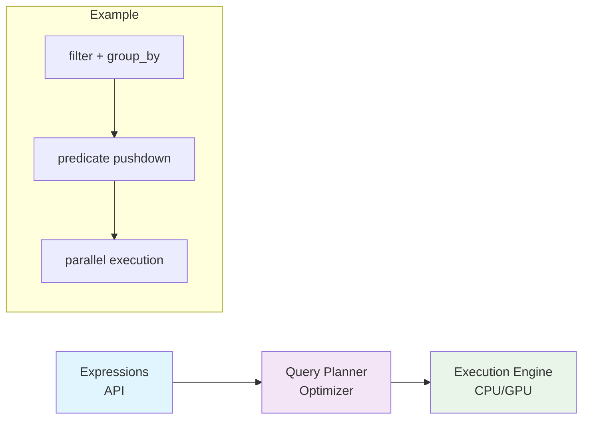
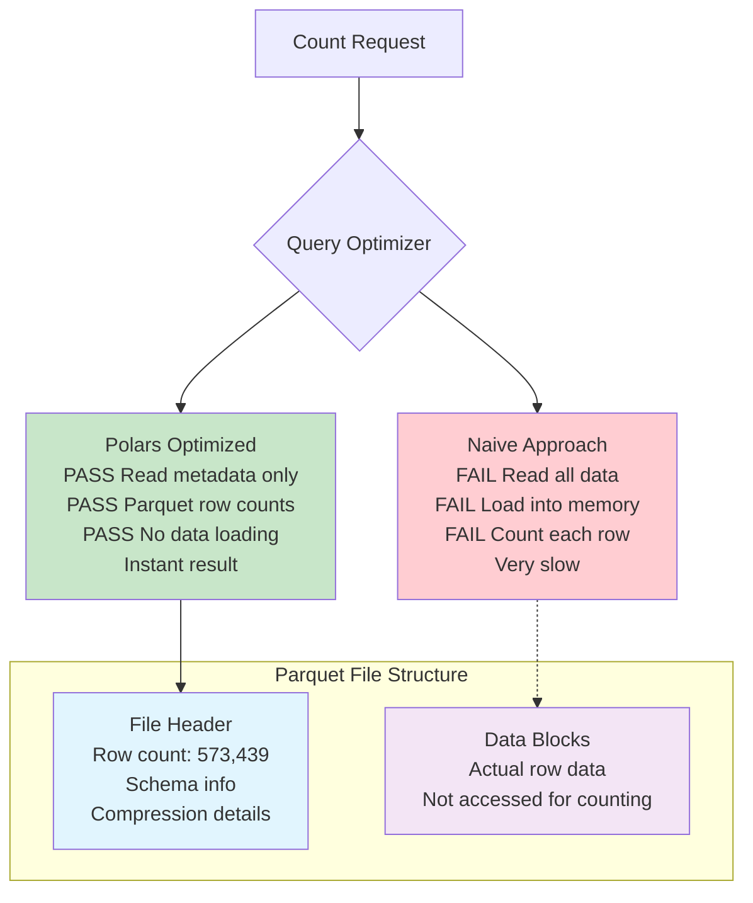
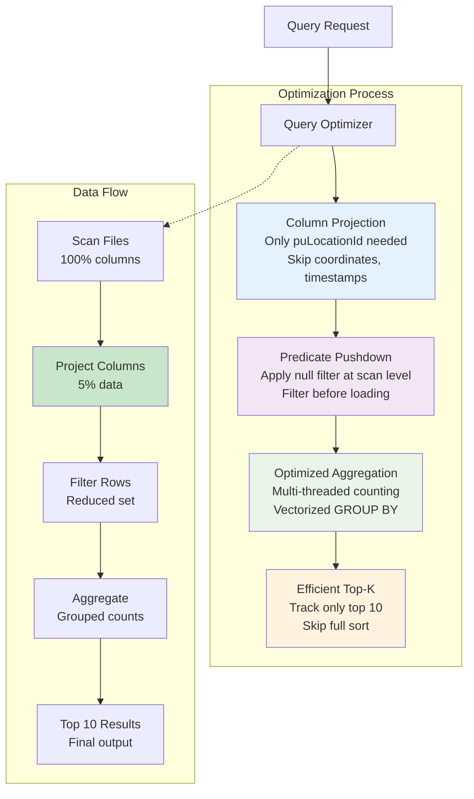
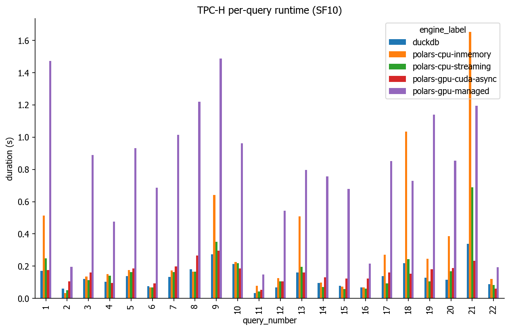
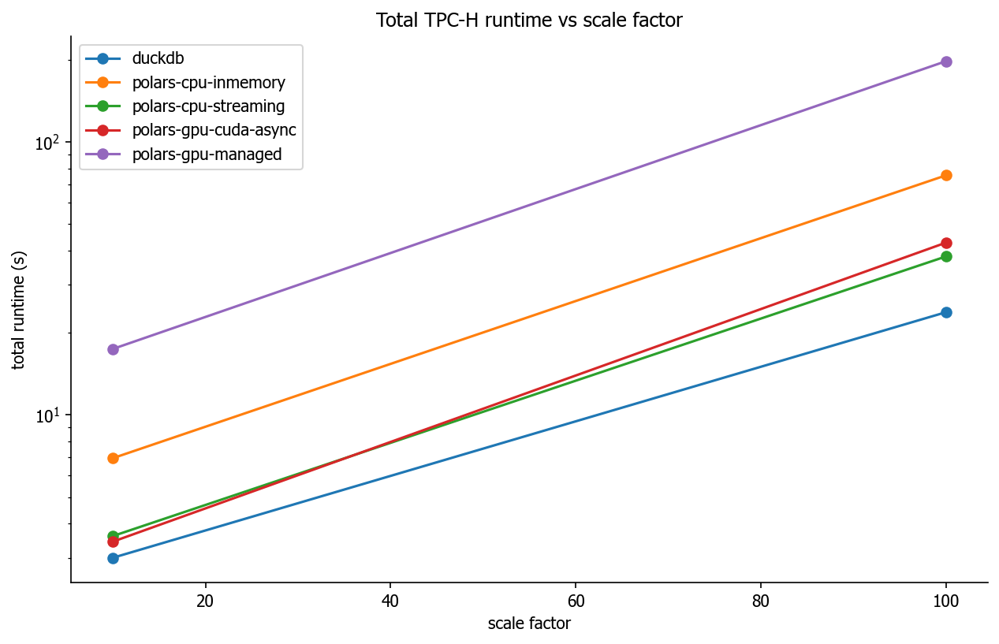
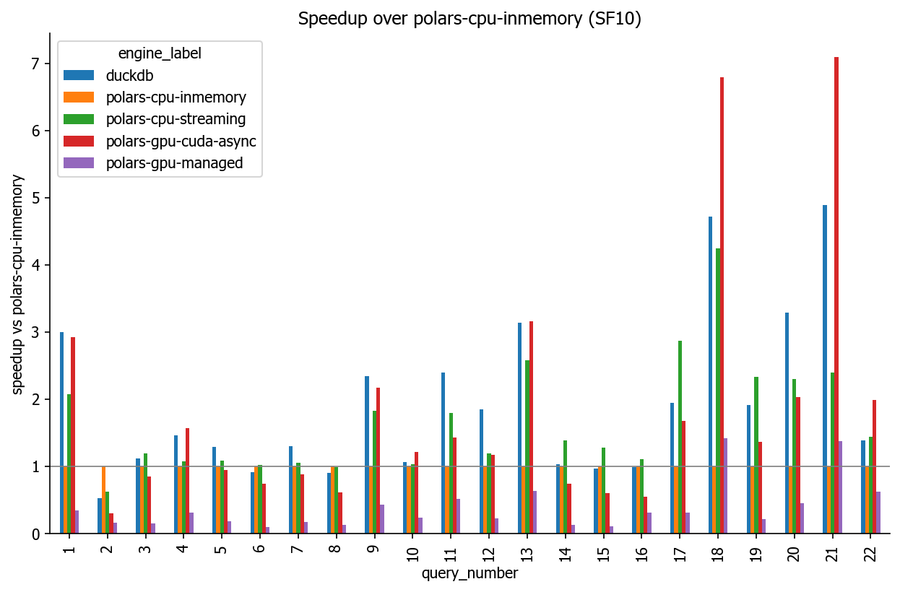
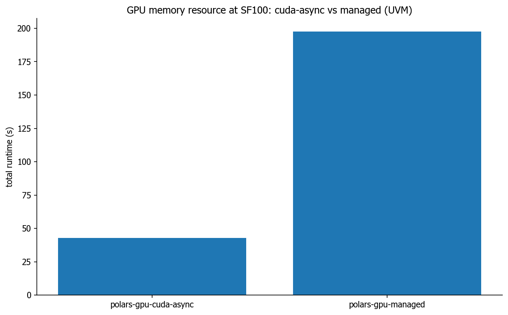
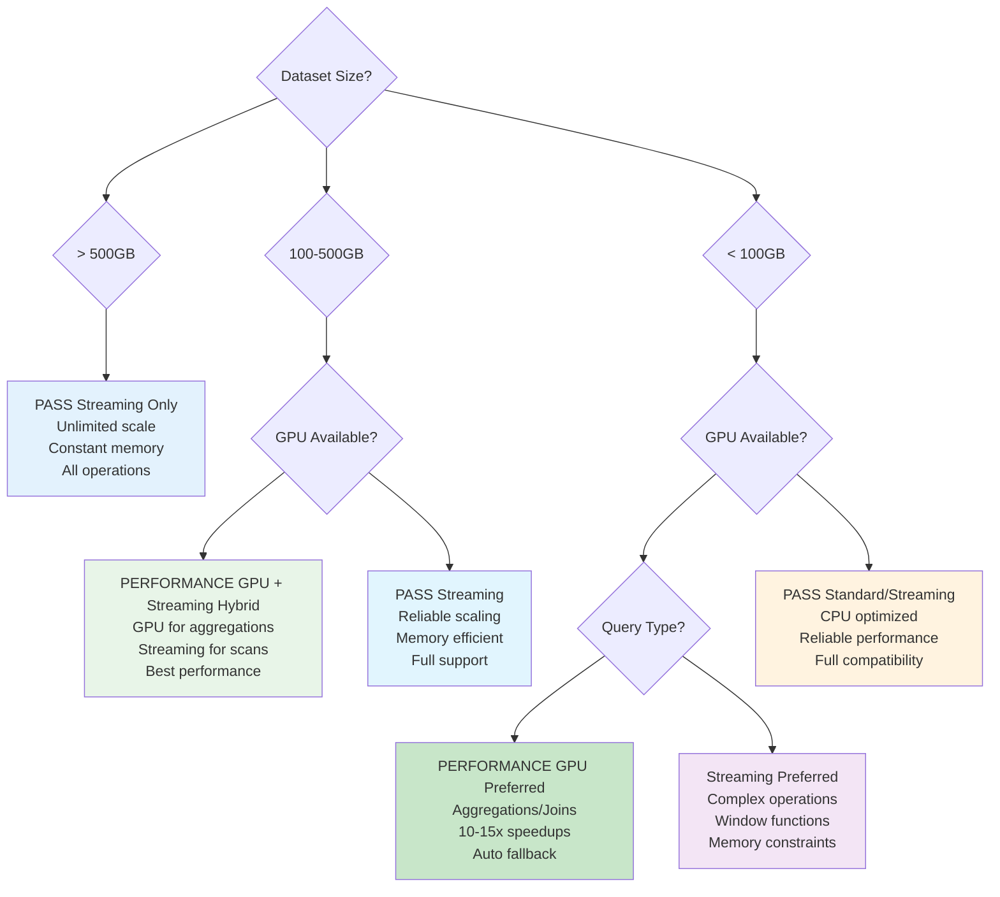

# A Big Bear Takes on the Big Apple

<!-- mtoc-start -->

* [Overview](#overview)
  * [The DataFrame Evolution: From Accessibility to Performance](#the-dataframe-evolution-from-accessibility-to-performance)
  * [The Memory Wall Problem](#the-memory-wall-problem)
  * [Enter Query Optimisation](#enter-query-optimisation)
  * [What We'll Demonstrate](#what-well-demonstrate)
    * [1. **Expressions: The Building Blocks of Every Query**](#1-expressions-the-building-blocks-of-every-query)
    * [2. **Lazy Evaluation and Query Optimisation**](#2-lazy-evaluation-and-query-optimisation)
    * [3. **Performance Across Different Hardware**](#3-performance-across-different-hardware)
  * [Code and Setup](#code-and-setup)
  * [**1. Count Rows Efficiently (Full Dataset Scan)**](#1-count-rows-efficiently-full-dataset-scan)
  * [**2. Find the Most Popular Pickup Locations**](#2-find-the-most-popular-pickup-locations)
  * [**3. Compute Daily Total Revenue (But Only for 2016)**](#3-compute-daily-total-revenue-but-only-for-2016)
  * [**4. Find the Longest Taxi Trips (Optimised Distance Query)**](#4-find-the-longest-taxi-trips-optimised-distance-query)
  * [**5. Query Plans in Detail**](#5-query-plans-in-detail)
    * [What This Query Demonstrates](#what-this-query-demonstrates)
* [Here Come the Hotstepper: GPU Acceleration](#here-come-the-hotstepper-gpu-acceleration)
  * [GPU System Requirements](#gpu-system-requirements)
  * [Installation and Setup](#installation-and-setup)
  * [The cuDF Landscape](#the-cudf-landscape)
  * [Polars GPU Engine: Best of Both Worlds](#polars-gpu-engine-best-of-both-worlds)
  * [GPU Detection and Automatic Fallback](#gpu-detection-and-automatic-fallback)
  * [Advanced GPU Engine Configuration](#advanced-gpu-engine-configuration)
  * [GPU Engine Limitations and Fallback Behavior](#gpu-engine-limitations-and-fallback-behavior)
  * [Performance Results: CPU vs GPU](#performance-results-cpu-vs-gpu)
    * [Benchmark Results](#benchmark-results)
    * [Performance Analysis](#performance-analysis)
    * [Memory and Dataset Considerations](#memory-and-dataset-considerations)
  * [Debugging and Monitoring GPU Usage](#debugging-and-monitoring-gpu-usage)
  * [Best Practices for GPU Acceleration](#best-practices-for-gpu-acceleration)
  * [Distributed Systems: Future Considerations](#distributed-systems-future-considerations)
  * [Pure cuDF Comparison](#pure-cudf-comparison)
    * [Key Differences](#key-differences)
* [Let's Get _GeoSpatial_](#lets-get-_geospatial)
* [**Key Takeaways**](#key-takeaways)
  * [Query Optimisation Benefits](#query-optimisation-benefits)
  * [Enhanced Streaming Decision Guidance](#enhanced-streaming-decision-guidance)
    * [Detailed Decision Matrix](#detailed-decision-matrix)
    * [Streaming Mode Advantages & Use Cases](#streaming-mode-advantages--use-cases)
    * [Hybrid Execution Patterns](#hybrid-execution-patterns)
* [Enhanced Troubleshooting Guide](#enhanced-troubleshooting-guide)
  * [Common File System Issues](#common-file-system-issues)
  * [GPU-Specific Issues](#gpu-specific-issues)
    * [CUDA Runtime Errors](#cuda-runtime-errors)
    * [GPU Memory Management](#gpu-memory-management)
    * [GPU Operation Not Supported](#gpu-operation-not-supported)
    * [Package Installation Issues](#package-installation-issues)
    * [Circular Import Errors](#circular-import-errors)
    * [Performance Debugging](#performance-debugging)
  * [Performance Monitoring and Optimization](#performance-monitoring-and-optimization)
    * [Environment-Specific Debugging](#environment-specific-debugging)

<!-- mtoc-end -->

> [!Warning]
>
> **This little "oh let me showcase the power of a query optimiser to
> people" somehow accidentally turned into quite an interesting side-project and
> so I am updating this as I go along. Local "big-data" processing has come a
> long way since I first starting look large scale data querying at the start of
> my PhD and it's incredible what can be done just on a laptop these days. As
> such, I plan to turn this into a proper blog post with notes etc, but that
> will come later. In the meantime, bear with me (_whey_, pun intended!) as
> this is very rough around the edges and will be updtated properly another
> time**

## Overview

Not too long ago, "Data Scientist" was dubbed the sexiest job title of the
decade, and since the early 2010s, it seems like a new DataFrame library has hit
the scene every other year.

While "Data Science" and the now ubiquitous "DataFrame" (think table of
data—maybe the dreaded Excel spreadsheet comes to mind) might be in their
infancy, relational database research, which essentially deals with tabular
data, is very mature.

### The DataFrame Evolution: From Accessibility to Performance

In 2012, `pandas` shot to fame with an easy Pythonic way to manipulate and
handle tabular data. Database administrators (DBAs) and SQL query-writing
wizards could no longer gatekeep their secrets—the power to manipulate "large"
datasets was now available to anyone with a bit of Python knowledge.

The trouble was that these new data science tools largely ignored the decades of
database research that came before. Can't blame them—they just wanted to get on
with visualising survival rates on the Titanic and building predictive models.

### The Memory Wall Problem

Over the years, the bifurcation continued with DataFrame libraries working with
data that could be processed in memory. But what happens when you have serious
big data or, worse yet, a super complex join of two tables?

The naive approach: bring everything into memory and hope that your large
outer-product cross-join intermediate computations can also fit in memory. But
_it need not be this way!_

### Enter Query Optimisation

Projects like Apache Spark were among the few libraries that took database
research seriously, putting significant effort into understanding how to create
effective query plans and optimisers.

**This is where Polars comes in.** As the Polars community says: **"Come for the
speed, stay for the API."** Polars bridges the gap between the ease of use that
made pandas popular and the sophisticated query optimisation that makes
databases efficient.

### What We'll Demonstrate

To showcase Polars' **lazy execution, query planning, and optimisation**, we'll
work with the **50GB (compressed[^1]) NYC Taxi dataset (~1.5 billion rows)** and
demonstrate how to efficiently query a larger-than-RAM dataset on a **32GB RAM
laptop**.

[^1]: Total uncompressed size: 62.59 GiB, calculated with `data/stats.py`

This demonstration will cover the core concepts that make Polars powerful:

#### 1. **Expressions: The Building Blocks of Every Query**
You'll see how Polars' expression system allows you to create complex data
transformations in a concise and readable way. Expressions are composable,
meaning you can build sophisticated operations from simple building blocks.

#### 2. **Lazy Evaluation and Query Optimisation**
- **Leverage lazy execution** (`pl.scan_parquet()`) instead of eager loading everything into memory
- **Push down predicates** to filter data **before** loading it into memory
- **Avoid unnecessary computations** through **query optimisations** like column projection
- **Use fast aggregations** to summarise large datasets efficiently

#### 3. **Performance Across Different Hardware**
We'll compare performance across different execution engines:
- **CPU with streaming**: Reliable for any dataset size
- **GPU acceleration**: Massive speedups for compute-heavy operations
- **Automatic fallback**: Graceful handling when operations aren't supported



### Code and Setup

The complete demonstration code is in `src/main.py`. To get started:

```bash
# For CPU-only execution
pip install -r requirements.txt

# For GPU acceleration (optional)
./install-gpu-deps.sh
```

The code intelligently detects your hardware and selects the appropriate
execution engine automatically.

### **1. Count Rows Efficiently (Full Dataset Scan)**

Let's first look at counting rows, all 1.5 _billion_ of them!

- Instead of materialising the dataset in memory, `polars` will _scan_ metadata
  to count rows efficiently.

```python
import polars as pl

# Lazy load the Parquet file (does NOT load into memory)
df = pl.scan_parquet("../data/nyc_yellow_taxi_parquet/*")

# Count total rows without loading the full dataset
row_count = df.select(pl.len()).collect(**collect_args)

print(row_count)
```

```python

shape: (1, 1)
┌────────────┐
│ len        │
│ ---        │
│ u32        │
╞════════════╡
│ 1571671152 │
└────────────┘
```

I've put the schema and a look at the first few rows to get us aquietad to the
data.

```python
Schema([('vendorID', String),
        ('tpepPickupDateTime', Datetime(time_unit='ns', time_zone=None)),
        ('tpepDropoffDateTime', Datetime(time_unit='ns', time_zone=None)),
        ('passengerCount', Int32),
        ('tripDistance', Float64),
        ('puLocationId', String),
        ('doLocationId', String),
        ('startLon', Float64),
        ('startLat', Float64),
        ('endLon', Float64),
        ('endLat', Float64),
        ('rateCodeId', Int32),
        ('storeAndFwdFlag', String),
        ('paymentType', String),
        ('fareAmount', Float64),
        ('extra', Float64),
        ('mtaTax', Float64),
        ('improvementSurcharge', String),
        ('tipAmount', Float64),
        ('tollsAmount', Float64),
        ('totalAmount', Float64)])

shape: (10, 21)
┌──────────┬─────────────────────┬─────────────────────┬────────────────┬───┬──────────────────────┬───────────┬─────────────┬─────────────┐
│ vendorID ┆ tpepPickupDateTime  ┆ tpepDropoffDateTime ┆ passengerCount ┆ … ┆ improvementSurcharge ┆ tipAmount ┆ tollsAmount ┆ totalAmount │
│ ---      ┆ ---                 ┆ ---                 ┆ ---            ┆   ┆ ---                  ┆ ---       ┆ ---         ┆ ---         │
│ str      ┆ datetime[ns]        ┆ datetime[ns]        ┆ i32            ┆   ┆ str                  ┆ f64       ┆ f64         ┆ f64         │
╞══════════╪═════════════════════╪═════════════════════╪════════════════╪═══╪══════════════════════╪═══════════╪═════════════╪═════════════╡
│ 2        ┆ 2002-12-31 23:58:47 ┆ 2003-01-01 00:09:49 ┆ 1              ┆ … ┆ 0.3                  ┆ 0.0       ┆ 0.0         ┆ 9.3         │
│ 2        ┆ 2002-12-31 23:04:50 ┆ 2003-01-01 06:42:58 ┆ 2              ┆ … ┆ 0.3                  ┆ 0.0       ┆ 0.0         ┆ 13.8        │
│ CMT      ┆ 2009-04-30 23:50:17 ┆ 2009-05-01 01:13:28 ┆ 1              ┆ … ┆ null                 ┆ 20.0      ┆ 0.0         ┆ 160.0       │
│ CMT      ┆ 2009-04-30 23:56:20 ┆ 2009-05-01 00:16:47 ┆ 1              ┆ … ┆ null                 ┆ 0.0       ┆ 0.0         ┆ 14.5        │
│ VTS      ┆ 2009-04-30 23:57:00 ┆ 2009-05-01 00:16:00 ┆ 1              ┆ … ┆ null                 ┆ 0.0       ┆ 0.0         ┆ 23.8        │
│ VTS      ┆ 2009-04-30 23:59:00 ┆ 2009-05-01 00:12:00 ┆ 2              ┆ … ┆ null                 ┆ 0.0       ┆ 0.0         ┆ 13.4        │
│ VTS      ┆ 2009-04-30 23:42:00 ┆ 2009-05-01 00:20:00 ┆ 1              ┆ … ┆ null                 ┆ 0.0       ┆ 0.0         ┆ 25.4        │
│ CMT      ┆ 2009-04-30 23:43:07 ┆ 2009-05-01 00:02:41 ┆ 1              ┆ … ┆ null                 ┆ 0.0       ┆ 4.15        ┆ 32.25       │
│ VTS      ┆ 2009-04-30 23:56:00 ┆ 2009-05-01 00:13:00 ┆ 1              ┆ … ┆ null                 ┆ 0.0       ┆ 0.0         ┆ 16.2        │
│ CMT      ┆ 2009-04-30 23:53:00 ┆ 2009-05-01 00:27:11 ┆ 1              ┆ … ┆ null                 ┆ 0.0       ┆ 0.0         ┆ 22.9        │
└──────────┴─────────────────────┴─────────────────────┴────────────────┴───┴──────────────────────┴───────────┴─────────────┴─────────────┘

```

**Why is this blazingly fast?**



This simple query demonstrates two key Polars optimisations:

- **Query Optimisation:** Polars automatically **pushes down the count
aggregation** to avoid reading the entire dataset. This is predicate pushdown in
action—the query planner recognises that counting rows doesn't require loading
data.
- **Metadata Scan:** Parquet files store **row counts in metadata**, allowing
**Polars to retrieve them without a full scan**. This is why we can count 1.5
billion rows almost instantaneously.

This exemplifies the sophisticated database research that Polars leverages.
Instead of naively loading and counting every row, Polars uses the same
optimisations that make modern databases efficient.

### **2. Find the Most Popular Pickup Locations**

- Using **groupby & aggregation** on the entire dataset but **only returning the top 10 results**.

```python
# Group by pickup location and count occurrences
popular_pickups = (
    df.filter(pl.col("puLocationId").is_not_null())
    .group_by("puLocationId")
    .agg(pl.len().alias("num_trips"))
    .sort("num_trips", descending=True)
    .limit(10)
    .collect(**collect_args)
)

print(popular_pickups)
```

**Why is this efficient?**



This query showcases multiple sophisticated optimisations working together:

- **Column Projection:** Polars automatically identifies that only
`puLocationId` is needed, avoiding loading unnecessary columns like coordinates,
timestamps, or fare amounts.
- **Predicate Pushdown:** The null filter is applied at the scan level,
eliminating rows before they enter the aggregation pipeline.
- **Optimised Aggregation:** Polars uses **multi-threading** and vectorised
operations for fast counting, similar to how modern databases handle GROUP BY
operations.
- **Efficient Top-K:** The `.limit(10)` is combined with the sort operation, so
Polars only needs to track the top 10 values rather than sorting the entire
result set.

This demonstrates how Polars' expression system composes efficiently—each
operation (`filter`, `group_by`, `agg`, `sort`, `limit`) is optimised both
individually and as part of the complete query plan.

### **3. Compute Daily Total Revenue (But Only for 2016)**

- **Time-based filtering** ensures **only necessary rows are read**.

```python
from datetime import datetime

# Filter for 2016 only and compute daily total fares
daily_revenue = (
    df.filter(
        pl.col("tpepPickupDateTime").is_between(
            datetime(2016, 1, 1), datetime(2016, 12, 31)
        )
    )
    .with_columns(pl.col("tpepPickupDateTime").dt.date().alias("date"))
    .group_by("date")
    .agg(pl.sum("fareAmount").alias("total_fare"))
    .sort("date")
    .collect(**collect_args)
)

print(daily_revenue)
```

**Why does this run well on 32GB RAM?**

- **Lazy Filtering:** The **date filter is pushed down**, meaning **only 2016
  trips are read**.
- **Column Pruning:** Polars **only loads `tpep_pickup_datetime` and
  `fare_amount`**, not the whole dataset.

### **4. Find the Longest Taxi Trips (Optimised Distance Query)**

- **Filtering + Sorting on large dataset**.

```python
# Filter for trips longer than 50 miles, sorted by distance
longest_trips = (
    df.filter(pl.col("tripDistance") > 50)
    .select(["tripDistance", "fareAmount"])
    .sort("tripDistance", descending=True)
    .limit(10)
    .collect(**collect_args)
)

print(longest_trips)
```

**Why does this perform well?**

- **Predicate Pushdown:** Only trips with `trip_distance > 50` are processed.
- **Column Projection:** Only four columns are read instead of all.

With these queries, you can **scan 1.5 billion rows efficiently** and **return
small, meaningful results** while keeping memory usage low! Cool right!?

Before going further let's step back a bit. We talked a lot about query
optimisation and planning but perhaps this is still not appreciated.

Query optimisation and planning often involves doing "predicate pushdown" and
"projection pushdown". If some of you are like me you might be asking what on
earth is the difference -- well an awesome explanation can be found [here](https://stackoverflow.com/questions/58235076/what-is-the-difference-between-predicate-pushdown-and-projection-pushdown)

Which essentially says, re-arrange the query so we touch as little data as
necessary! Let's have a closer look with the next example.

### **5. Query Plans in Detail**

`polars` has one of the best query planners and optimisers in the business and
we can get more of a feel for what is going on if we inspect the query with
`df.explain()`. Here we show a much more complex query that does many different
filtering operations and aggregations.

It leverages `polars`’ lazy evaluation, predicate pushdown, column projection, and
streaming mode. Working with the same dataset as before we will chain several
advanced operations in one go.

```python
# Define a bounding box for NYC (approximate)
min_lat, max_lat = 40.5, 40.9
min_lon, max_lon = -74.25, -73.70

result = (
    df
    # Filter out rows with null puLocationId and restrict to 2016
    # .filter(pl.col("puLocationId").is_not_null())
    .filter(
        pl.col("tpepPickupDateTime").is_between(
            datetime(2010, 1, 1), datetime(2018, 1, 1)
        )
    )
    # Filter trips by the NYC bounding box (based on startLat and startLon)
    .filter(
        (pl.col("startLat") >= min_lat)
        & (pl.col("startLat") <= max_lat)
        & (pl.col("startLon") >= min_lon)
        & (pl.col("startLon") <= max_lon)
    )
    # # Compute trip duration in minutes (convert nanoseconds to minutes)
    .with_columns(
        (
            (pl.col("tpepDropoffDateTime") - pl.col("tpepPickupDateTime")).cast(
                pl.Int64
            )
            / 1e9
            / 60
        ).alias("trip_duration")
    )
    # # Calculate average speed in mph: (tripDistance miles) / (duration in hours)
    .with_columns(
        (pl.col("tripDistance") * 60 / pl.col("trip_duration")).alias("avg_speed")
    )
    # Additional filtering on computed metrics:
    #   - Ensure positive trip duration,
    #   - Keep trips longer than 0.5 miles,
    #   - Fare amount below 150
    .filter((pl.col("trip_duration") > 0) & (pl.col("fareAmount") < 150))
    # Extract the date from the pickup datetime
    .with_columns(pl.col("tpepPickupDateTime").dt.date().alias("date"))
    # # Group by date and paymentType and compute aggregates
    .group_by(["date", "paymentType"])
    .agg(
        [
            pl.len().alias("num_trips"),
            pl.mean("tripDistance").alias("avg_trip_distance"),
            pl.sum("fareAmount").alias("total_fare"),
            pl.mean("trip_duration").alias("avg_duration"),
            pl.mean("avg_speed").alias("avg_speed"),
            pl.mean("tipAmount").alias("avg_tip"),
        ]
    )
    .sort(["date", "paymentType"])
)

```

#### What This Query Demonstrates

- **Predicate Pushdown & Column Projection:** The filters on
  **tpepPickupDateTime**, **startLat**, **startLon**, and **puLocationId** are
  pushed down to the data source. This means Polars only loads the row groups that
  could possibly match these conditions—vital when dealing with billions of rows.

- **Lazy Evaluation & Streaming:** By using `pl.scan_parquet(...,
streaming=True)` and deferring execution until the final `.collect()`, the query
  planner optimises the entire operation, ensuring minimal memory usage even on a
  laptop with 32 GB of RAM.

- **Complex Aggregation & Derived Metrics:** The query computes additional
  columns (trip duration, average speed) and applies further filtering on these
  derived values. Then, grouping by date and payment type demonstrates the power
  of Polars’ parallel aggregations over massive datasets.

I encourage the reader to go over and play with it by removing filters but for
now the main thing is to inspect to two different query plan graphs, the first
being an **un-optimised query plan** and then followed by the **optimised query
plan** version -- do you spot a difference?

**1. Un-optimised**

```bash
NAIVE Q-PLAN:
 SORT BY [col("date"), col("paymentType")]
  AGGREGATE
        [len().alias("num_trips"), col("tripDistance").mean().alias("avg_trip_distance"), col("fareAmount").sum().alias("total_fare"), col("trip_duration").mean().alias("avg_duration"), col("avg_speed").mean().alias("avg_speed"), col("tipAmount").mean().alias("avg_tip")] BY [col("date"), col("paymentType")] FROM
     WITH_COLUMNS:
     [col("tpepPickupDateTime").dt.date().alias("date")]
      FILTER [(col("trip_duration")) > (0.0)] FROM
        FILTER [(col("fareAmount")) < (150.0)] FROM
           WITH_COLUMNS:
           [[([(col("tripDistance")) * (60.0)]) / (col("trip_duration"))].alias("avg_speed")]
             WITH_COLUMNS:
             [[([([(col("tpepDropoffDateTime")) - (col("tpepPickupDateTime"))].strict_cast(Int64).cast(Unknown(Float))) / (dyn float: 1.0000e9)]) / (60.0)].alias("trip_duration")]
              FILTER [(col("startLat")) >= (40.5)] FROM
                FILTER [(col("startLat")) <= (40.9)] FROM
                  FILTER [(col("startLon")) >= (-74.25)] FROM
                    FILTER [(col("startLon")) <= (-73.7)] FROM
                      FILTER col("tpepPickupDateTime").strict_cast(Datetime(Microseconds, None)).is_between([2010-01-01 00:00:00, 2018-01-01 00:00:00]) FROM
                        Parquet SCAN [../data/nyc_yellow_taxi_parquet/part-00000-tid-8898858832658823408-a1de80bd-eed3-4d11-b9d4-fa74bfbd47bc-426339-1.c000.snappy.parquet, ... 2712 other sources]
                        PROJECT */21 COLUMNS
SORT BY [col("date"), col("paymentType")]
  AGGREGATE
        [len().alias("num_trips"), col("tripDistance").mean().alias("avg_trip_distance"), col("fareAmount").sum().alias("total_fare"), col("trip_duration").mean().alias("avg_duration"), col("avg_speed").mean().alias("avg_speed"), col("tipAmount").mean().alias("avg_tip")] BY [col("date"), col("paymentType")] FROM
     WITH_COLUMNS:
     [col("tpepPickupDateTime").dt.date().alias("date")]
      FILTER [(col("trip_duration")) > (0.0)] FROM
        FILTER [(col("fareAmount")) < (150.0)] FROM
           WITH_COLUMNS:
           [[([(col("tripDistance")) * (60.0)]) / (col("trip_duration"))].alias("avg_speed")]
             WITH_COLUMNS:
             [[([([(col("tpepDropoffDateTime")) - (col("tpepPickupDateTime"))].strict_cast(Int64).cast(Unknown(Float))) / (dyn float: 1.0000e9)]) / (60.0)].alias("trip_duration")]
              FILTER [(col("startLat")) >= (40.5)] FROM
                FILTER [(col("startLat")) <= (40.9)] FROM
                  FILTER [(col("startLon")) >= (-74.25)] FROM
                    FILTER [(col("startLon")) <= (-73.7)] FROM
                      FILTER col("tpepPickupDateTime").strict_cast(Datetime(Microseconds, None)).is_between([2010-01-01 00:00:00, 2018-01-01 00:00:00]) FROM
                        Parquet SCAN [../data/nyc_yellow_taxi_parquet/part-00000-tid-8898858832658823408-a1de80bd-eed3-4d11-b9d4-fa74bfbd47bc-426339-1.c000.snappy.parquet, ... 2712 other sources]
                        PROJECT */21 COLUMNS

```

**2. Optimised**

```bash
OPTIMIZED Q-PLAN:
 SORT BY [col("date"), col("paymentType")]
  AGGREGATE
        [len().alias("num_trips"), col("tripDistance").mean().alias("avg_trip_distance"), col("fareAmount").sum().alias("total_fare"), col("trip_duration").mean().alias("avg_duration"), col("avg_speed").mean().alias("avg_speed"), col("tipAmount").mean().alias("avg_tip")] BY [col("date"), col("paymentType")] FROM
     WITH_COLUMNS:
     [[([(col("tripDistance")) * (60.0)]) / (col("trip_duration"))].alias("avg_speed"), col("tpepPickupDateTime").dt.date().alias("date")]
      FILTER [(col("trip_duration")) > (0.0)] FROM
         WITH_COLUMNS:
         [[([([(col("tpepDropoffDateTime")) - (col("tpepPickupDateTime"))].strict_cast(Int64).cast(Unknown(Float))) / (dyn float: 1.0000e9)]) / (60.0)].alias("trip_duration")]
          Parquet SCAN [../data/nyc_yellow_taxi_parquet/part-00000-tid-8898858832658823408-a1de80bd-eed3-4d11-b9d4-fa74bfbd47bc-426339-1.c000.snappy.parquet, ... 2712 other sources]
          PROJECT 8/21 COLUMNS
          SELECTION: [([([([(col("fareAmount")) < (150.0)]) & ([([(col("startLat")) <= (40.9)]) & ([(col("startLat")) >= (40.5)])])]) & ([([(col("startLon")) <= (-73.7)]) & ([(col("startLon")) >= (-74.25)])])]) & (col("tpepPickupDateTime").strict_cast(Datetime(Microseconds, None)).is_between([2010-01-01 00:00:00, 2018-01-01 00:00:00]))]


```

The first to mention is how to even read this -- one starts from the bottom and
works their way up the tree. With that in mind, what's happening? Well, first
difference to notice is the reduction in lines. _Ok great, what does that even
mean?_

Each line represents a computation on an intermediate set of data. This is
particularly apparent with these lines from the unoptimised version:

```diff
...
-  FILTER [(col("startLat")) >= (40.5)] FROM
-    FILTER [(col("startLat")) <= (40.9)] FROM
-      FILTER [(col("startLon")) >= (-74.25)] FROM
-        FILTER [(col("startLon")) <= (-73.7)] FROM
-          FILTER col("tpepPickupDateTime").strict_cast(Datetime(Microseconds, None)).is_between([2010-01-01 00:00:00, 2018-01-01 00:00:00]) FROM
+ SELECTION: [([([([(col("fareAmount")) < (150.0)]) & ([([(col("startLat")) <= (40.9)]) & ([(col("startLat")) >= (40.5)])])]) & ([([(col("startLon")) <= (-73.7)]) & ([(col("startLon")) >= (-74.25)])])]) & (col("tpepPickupDateTime").strict_cast(Datetime(Microseconds, None)).is_between([2010-01-01 00:00:00, 2018-01-01 00:00:00]))]
..
```

This means we are applying a filter, creating a new intermediate set of data and
then moving on to the next bit and so on, very inefficient.

Another big one is this difference:

```diff
-          PROJECT */21 COLUMNS
+          PROJECT 8/21 COLUMNS

```

When you hear `PROJECT` then we are dealing with _columns_, so one is saying
give me **all** columns with the `*` and the other is saying "oh, don't mind
me, I only need 8 out of all 21 columns you have Mr. parquet file". In concrete
terms it means that only 8 columns are read from disk which can be huge,
especially in this case!

When we run the final query in `src/main.py` on a 32 GB M2 Mac it takes about

```console
real    2m8.376s
user    4m11.232s
sys     0m56.340s

```

So, long story short, a query optimiser is key in efficient processing of big
data! `polars` applies several types of optimizations,
including:

- Predicate pushdown: Applies filters as early as possible, often at the scan
  level.
- Projection pushdown: Selects only the necessary columns at the scan level.
- Slice pushdown: Only loads the required slice from the scan level.
- Common subplan elimination: Caches subtrees/file scans used by multiple
  subtrees in the query plan.
- Simplify expressions: Performs various optimizations like constant folding and
  replacing expensive operations with faster alternatives.
- Join ordering: Estimates which branches of joins should be executed first to
  reduce memory pressure.
- Type coercion: Coerces types for successful operations and minimal memory
  usage.
- Cardinality estimation: Estimates cardinality to determine the optimal
  group-by strategy.

Some optimizations run once, while others run multiple times until a fixed point
is reached. For example, predicate pushdown runs once, while simplify
expressions runs until a fixed point is reached.

## Here Come the Hotstepper: GPU Acceleration

As the Polars community says: "Come for the speed, stay for the API." When you
have a powerful GPU sitting idle, why not put it to work? With Polars' GPU
engine, you can leverage both the query optimisation we've explored above AND
the computational brute force of modern GPUs.

### GPU System Requirements

Before diving into GPU acceleration, ensure your system meets these
requirements:

- **GPU**: NVIDIA Volta™ architecture or higher with compute capability 7.0+
- **CUDA**: Version 12 (CUDA 11 support deprecated after RAPIDS v25.06)
- **Operating System**: Linux or Windows Subsystem for Linux 2 (WSL2)
- **Memory**: 24GB+ VRAM recommended for datasets 50-100 GiB in size
- **Driver**: Latest NVIDIA drivers with CUDA runtime support

### Installation and Setup

The project includes a comprehensive GPU setup script that installs all
necessary RAPIDS components:

```bash
# Install GPU dependencies (RAPIDS cuDF, Polars GPU engine)
./install-gpu-deps.sh
```

This script installs:
- RAPIDS cuDF ecosystem (cuDF, cuML, cuGraph, etc.)
- Polars with GPU engine support
- All necessary CUDA dependencies

For manual installation:

```bash
# Install Polars with GPU support
pip install polars[gpu] --extra-index-url=https://pypi.nvidia.com

# Install RAPIDS cuDF (for comparison examples)
pip install --extra-index-url=https://pypi.nvidia.com \
    "cudf-cu12==25.2.*" "dask-cudf-cu12==25.2.*"
```

### The cuDF Landscape

The traditional go-to DataFrame library for GPU processing is `cuDF`, developed
by the RAPIDS team at NVIDIA[^2]. While `cuDF` is indeed blazingly fast and
allows for massive parallelism, it **does not** have an inbuilt optimiser or
query planner. This means queries require the **full** dataset to be brought
into VRAM.

Now with what we've seen about query optimisation above, that seems like a
missed opportunity, right?

[^2]: We are only really considering NVIDIA chips, for reasons. Good reasons.

`cuDF` is primarily designed for eager execution—much like `pandas`, but on the
GPU, so it doesn't include a built‑in lazy query planning engine like `polars`
does. Instead, `cuDF`'s optimisations come from highly optimised GPU kernels and
vectorised operations that execute immediately.

That said, when reading data (for example, from `parquet` files), some predicate
pushdown may be performed by the underlying file reader (often via Apache
Arrow), which can reduce the amount of data loaded into memory. But beyond that,
`cuDF` processes queries eagerly without a separate query planning phase.

### Polars GPU Engine: Best of Both Worlds

_But I want to use my super cool gold box (NVIDIA DGX)!_

Enter Polars' GPU engine. With `lf.collect(engine="gpu")`, you get the best of
both worlds: Polars' sophisticated query planning and optimisation combined with
the computational brute force of modern GPUs. By clever construction of queries,
we minimise data movement and the amount that needs to sit on the GPU at any
time.

### GPU Detection and Automatic Fallback

Our `src/main.py` demonstrates intelligent GPU detection with automatic
fallback:

```python
import subprocess
import polars as pl

def is_nvidia_gpu_available():
    """Check if NVIDIA GPU is available and accessible."""
    try:
        subprocess.run(
            ["nvidia-smi"],
            stdout=subprocess.PIPE,
            stderr=subprocess.PIPE,
            check=True
        )
        return True
    except (subprocess.CalledProcessError, FileNotFoundError):
        return False

# Dynamic engine selection
collect_args = {}
if is_nvidia_gpu_available():
    collect_args["engine"] = "gpu"
    print("NVIDIA GPU detected, using GPU engine for collection.")
else:
    collect_args["engine"] = "streaming"
    print("No NVIDIA GPU detected, using streaming mode for collection.")

# Use throughout your queries
result = df.group_by("column").sum().collect(**collect_args)
```

### Advanced GPU Engine Configuration

The `collect()` method offers comprehensive control over execution with both string and object forms:

```python
import polars as pl

# Basic GPU execution (string form)
result = lf.collect(engine="gpu")

# Advanced GPU engine configuration (object form)
gpu_engine = pl.GPUEngine(
    device=0,                           # Specify GPU device (for multi-GPU systems)
    raise_on_fail=True,                # Disable CPU fallback, raise on unsupported operations
    memory_resource="managed",          # Memory management: "pool", "managed", "arena"
    memory_fraction=0.8                # Reserve 80% of VRAM for operations
)
result = lf.collect(engine=gpu_engine)

# Production GPU configuration with error handling
class GPUExecutor:
    """Production-ready GPU execution with fallback strategies"""

    @staticmethod
    def get_optimal_engine(query_complexity: str = "medium", vram_gb: int = 24):
        """Select optimal GPU engine based on query complexity and available VRAM"""
        if query_complexity == "simple":
            return pl.GPUEngine(
                device=0,
                raise_on_fail=False,           # Allow CPU fallback
                memory_resource="managed",      # Lower memory pressure
                memory_fraction=0.6
            )
        elif query_complexity == "complex":
            return pl.GPUEngine(
                device=0,
                raise_on_fail=True,            # Fail fast for debugging
                memory_resource="pool",        # Optimised memory allocation
                memory_fraction=0.9 if vram_gb >= 40 else 0.7
            )
        return "cpu"  # Default fallback

    @staticmethod
    def safe_gpu_collect(lf, complexity="medium"):
        """Execute with automatic fallback and performance monitoring"""
        import time
        import subprocess

        # Check available VRAM before execution
        try:
            result = subprocess.run(
                ["nvidia-smi", "--query-gpu=memory.total", "--format=csv,noheader,nounits"],
                capture_output=True, text=True, check=True
            )
            vram_gb = int(result.stdout.strip()) // 1024
        except:
            vram_gb = 0

        if vram_gb < 8:
            print(f"WARNING: Low VRAM ({vram_gb}GB), using streaming mode")
            return lf.collect(streaming=True)

        engine = GPUExecutor.get_optimal_engine(complexity, vram_gb)

        try:
            start_time = time.time()
            result = lf.collect(engine=engine)
            execution_time = time.time() - start_time
            print(f"SUCCESS: GPU execution completed in {execution_time:.2f}s")
            return result
        except pl.exceptions.ComputeError as e:
            print(f"WARNING: GPU execution failed: {e}")
            print("Falling back to streaming mode...")
            return lf.collect(streaming=True)

# Usage examples
result = GPUExecutor.safe_gpu_collect(lf, complexity="simple")

# Manual engine selection with monitoring
with pl.Config() as cfg:
    cfg.set_verbose(True)  # Show GPU operation warnings
    result = lf.collect(engine=pl.GPUEngine(device=0, raise_on_fail=False))

# Background execution with progress monitoring
handle = lf.collect(background=True, engine="gpu")
while not handle.is_finished():
    time.sleep(1)
    print("Processing...")
result = handle.join()
```

### GPU Engine Limitations and Fallback Behavior

The GPU engine has some important limitations to understand:

- **No Streaming Support**: GPU engine cannot use `streaming=True` mode
- **Lazy API Only**: GPU acceleration only available through LazyFrame API
- **Automatic Fallback**: Unsupported operations fall back to CPU automatically

```python
# This combination will automatically fall back to CPU
result = lf.collect(engine="streaming")  # Use streaming engine for larger-than-memory datasets

# GPU engines are incompatible with streaming mode
# This would issue a warning and disable GPU:
# result = lf.collect(engine="gpu", streaming=True)  # streaming parameter deprecated
```

Remember that the GPU engine is in Open Beta and undergoing rapid development.

### Performance Results: CPU vs GPU

The NYC taxi queries above are the narrative; the rigorous numbers come from the
official PDS/TPC-H benchmark (vendored in `libs/polars-benchmark`) run end to end
on a real GPU. All 22 standard TPC-H queries execute on every engine at scale
factors 10 and 100, three timed iterations each (median reported), driven by the
thin orchestrator in `benchmarks/`.

- **GPU**: NVIDIA GeForce RTX 4090, 24GB VRAM
- **CPU**: 48 cores, 125GB RAM
- **Software**: Polars 1.31, cudf-polars 25.08, DuckDB 1.3, tpchgen 2.0

The monetary `Decimal` columns produced by `tpchgen-cli` are cast to `Float64`
during data preparation, because cudf-polars does not support the `Decimal` dtype
on GPU. Every engine reads the identical float data, so the comparison stays fair.


#### Benchmark Results

Total wall-clock to run all 22 TPC-H queries (median of 3 iterations), in seconds:

| Engine | SF10 | SF100 |
|--------|-----:|------:|
| DuckDB | 3.0 | 23.8 |
| Polars GPU (cuda-async) | 3.4 | 42.8 |
| Polars CPU (streaming) | 3.6 | 38.1 |
| Polars CPU (in-memory) | 6.9 | 75.4 |
| Polars GPU (managed / UVM) | 17.4 | 197.5 |





#### Performance Analysis

The headline is honest rather than triumphant: the fastest engine depends on the
workload, and the GPU is a strong but not dominant option for these analytical
queries.

- **GPU acceleration is real at SF10.** The Polars GPU engine (cuda-async) runs
  the full suite in 3.4s versus 6.9s for the Polars CPU in-memory engine, roughly
  a 2x speedup, and lands within a whisker of DuckDB.
- **DuckDB is the overall champion** on TPC-H at both scales. Its query optimiser
  and vectorised execution are hard to beat on join and aggregation heavy
  analytics; at SF100 it finishes in 23.8s.
- **Polars streaming is the best CPU trade-off.** It beats the in-memory engine at
  both scales and edges out the GPU at SF100 (38.1s vs 42.8s) while using a
  fraction of the memory.
- **The GPU advantage narrows at SF100.** Larger inputs mean more host-to-device
  transfer over PCIe, so the GPU (42.8s) sits between streaming and in-memory
  rather than out in front.



#### Memory and Dataset Considerations: the UVM result

The most instructive finding concerns Unified Virtual Memory (the RMM `managed`
memory resource, the subject of the
[Polars larger-than-RAM GPU post](https://pola.rs/posts/uvm-larger-than-ram-gpu/)).
UVM lets the GPU spill past its 24GB of VRAM into host RAM, so you can process
working sets that do not fit on the card.



In this benchmark UVM is consistently the slowest configuration: 17.4s at SF10 and
197.5s at SF100, about 5x slower than cuda-async at SF100. The reason is that
TPC-H queries project only the columns they need, so even at SF100 each query's
working set stays under 24GB and fits in VRAM. The cuda-async engine therefore
completes every query without spilling, while the managed engine pays the
page-migration cost of UVM for no benefit.

The practical lesson: UVM is an escape hatch, not a free lunch. Reach for
`managed` memory only when a query genuinely exceeds VRAM and the alternative is
failing outright; when the working set fits, plain `cuda-async` is far faster. To
actually exercise the larger-than-VRAM path on a 24GB card you need queries that
materialise more than 24GB at once (wider projections, or scale factors well
beyond 100).

Reproduce the full sweep with:

```bash
# on the GPU host: generate data, run all engines at SF10 and SF100
.venv/bin/python -m benchmarks.run --scales 10,100 --iterations 3

# render the Tahoma-styled plots locally from the results
.venv/bin/python -m benchmarks.run --plot-only
```

### Debugging and Monitoring GPU Usage

To understand whether your queries are actually using the GPU, Polars provides several debugging tools:

```python
import polars as pl

# Enable verbose mode to see GPU usage warnings
with pl.Config() as cfg:
    cfg.set_verbose(True)
    result = lf.collect(engine="gpu")
    # Will show: "PerformanceWarning: Query execution with GPU not supported, reason: ..."

# Disable fallback to catch unsupported operations
try:
    result = lf.collect(engine=pl.GPUEngine(raise_on_fail=True))
except pl.exceptions.ComputeError as e:
    print(f"GPU execution failed: {e}")
    # Fall back to streaming or handle appropriately

# Monitor GPU memory usage (external tool)
# Run in separate terminal: nvidia-smi --query-gpu=memory.used,memory.total --format=csv --loop=1
```

### Best Practices for GPU Acceleration

1. **Start Simple**: Test with basic aggregations before complex queries
2. **Monitor Memory**: Watch VRAM usage with `nvidia-smi`
3. **Use Lazy Evaluation**: Build complete query plans before execution
4. **Handle Fallbacks**: Always have CPU streaming as backup
5. **Batch Processing**: For very large datasets, process in chunks

<!-- TODO: Update the note below because that is not what we do now -->
> [!NOTE]
>
> **Real-World Considerations**: For our most complex query (the final
> aggregation in `src/main.py`), we actually used
> `result.collect(engine="streaming")` instead of pure GPU execution. The GPU
> engine's intermediate memory usage can explode during complex operations,
> ultimately causing out-of-memory errors.
>
> This highlights a key limitation: the GPU engine currently doesn't support streaming mode. When attempting to use both:
>
> ```python
> # This will disable GPU and use streaming instead
> if (streaming or background or new_streaming) and is_gpu:
>     issue_warning(
>         "GPU engine does not support streaming or background collection, "
>         "disabling GPU engine."
>     )
> ```
>
> **Practical Recommendation**: For very large or complex queries, the streaming
> engine (`engine="streaming"`) may be more reliable than GPU, especially if you have
> many CPU cores available. The choice depends on your specific workload characteristics.
>
> **Note**: As of RAPIDS 25.06+, experimental GPU streaming is available via
> `pl.GPUEngine(executor="streaming")` for datasets larger than VRAM.

### Distributed Systems: Future Considerations

For truly massive datasets that exceed single-GPU capabilities, distributed
systems become relevant. Consider these options if data movement overhead is
manageable:

- **[Apache Spark](https://github.com/apache/spark)**: Mature but JVM-based,
row-oriented
- **[Daft](https://github.com/Eventual-Inc/Daft)**: Rust-based, columnar-first
🦀
- **[Ballista](https://github.com/apache/datafusion-ballista)**: Rust-based
distributed DataFusion 🦀

The newer Rust-based engines (Daft, Ballista) offer promising columnar-first
architectures compared to Spark's row-oriented JVM approach.

### Pure cuDF Comparison

To demonstrate the difference between cuDF's eager execution and Polars'
optimised approach, we can compare implementations:

```python
# Pure cuDF: Eager execution, no query optimisation
import cudf

# Must load entire dataset into VRAM immediately
df_gpu = cudf.read_parquet("data/nyc_taxi.parquet")  # OOM risk here!

# Compute aggregations eagerly
popular_locations = (
    df_gpu.dropna(subset=["puLocationId"])
    .groupby("puLocationId")
    .size()
    .sort_values(ascending=False)
    .head(10)
)

# Polars GPU: Lazy execution with query optimisation
import polars as pl

# Scan without loading
popular_locations = (
    pl.scan_parquet("data/nyc_taxi.parquet")
    .filter(pl.col("puLocationId").is_not_null())      # Predicate pushdown
    .group_by("puLocationId")                           # Pushed to GPU
    .agg(pl.len().alias("num_trips"))                  # Efficient aggregation
    .sort("num_trips", descending=True)                 # GPU-accelerated sort
    .limit(10)                                          # Only materialise top 10
    .collect(engine="gpu")                              # Execute plan on GPU
)
```

#### Key Differences

| Aspect | Pure cuDF | Polars GPU Engine |
|--------|-----------|------------------|
| **Memory Usage** | Load full dataset | Load only necessary data |
| **Query Planning** | Manual optimisation | Automatic optimisation |
| **Predicate Pushdown** | Manual implementation | Automatic |
| **Column Pruning** | Manual selection | Automatic |
| **Error Handling** | Manual fallback | Automatic CPU fallback |
| **Memory Management** | Manual | Automatic chunking |

The Polars approach combines the best of both worlds: sophisticated query optimisation with GPU acceleration.

## Let's Get _GeoSpatial_

<!-- NOTE: This will come when is closed. As of July 2025 it is actively being worked on! -->
<!---->
<!-- ```bash -->
<!-- brew install h3 -->
<!-- ``` -->

## **Key Takeaways**

### Query Optimisation Benefits

| Query Type | Polars Optimisation Used | GPU Acceleration Benefit |
|------------|--------------------------|-------------------------|
| **Count total rows** | Metadata scan, no full load | Minimal (I/O bound) |
| **Top pickup locations** | GroupBy pushdown, column pruning | **Excellent** (5-15x speedup) |
| **Daily revenue for 2016** | Date filtering pushdown | Good (2-5x speedup) |
| **Find longest trips** | Filter + sort optimisation | Good (2-5x speedup) |

### Enhanced Streaming Decision Guidance

Choose the optimal execution strategy based on your specific requirements:



#### Detailed Decision Matrix

| Scenario | Dataset Size | GPU Available | Memory | Recommended Strategy | Reasoning |
|----------|--------------|---------------|---------|---------------------|-----------|
| **Big Data Analytics** | >1TB | NO | 32-64GB | Streaming | Constant memory, unlimited scale |
| **ML Feature Engineering** | 100-500GB | YES | 64GB+ | GPU + Streaming | GPU for aggregations, streaming for transforms |
| **Real-time Dashboard** | 10-100GB | YES | 32GB+ | GPU Primary | Fast aggregations, auto-fallback |
| **Complex Analytics** | 50-200GB | YES | 16-32GB | Streaming Primary | Memory constraints, complex operations |
| **Development/Testing** | <10GB | Any | Any | Standard/GPU | Fast iteration, full features |

#### Streaming Mode Advantages & Use Cases

```python
# Use streaming when:
# PASS Dataset larger than available RAM
# PASS Complex window functions or rolling operations
# PASS Memory-constrained environments
# PASS Production reliability is critical
# PASS Full Polars operation support needed

def should_use_streaming(dataset_size_gb: int, available_ram_gb: int,
                        query_type: str, gpu_available: bool) -> dict:
    """
    Intelligent streaming decision logic based on multiple factors
    """
    decision = {
        "use_streaming": False,
        "use_gpu": False,
        "reasoning": [],
        "confidence": 0.0
    }

    # Size-based decisions
    if dataset_size_gb > available_ram_gb * 0.8:
        decision["use_streaming"] = True
        decision["reasoning"].append(f"Dataset ({dataset_size_gb}GB) exceeds 80% of RAM ({available_ram_gb}GB)")
        decision["confidence"] += 0.4

    if dataset_size_gb > 500:
        decision["use_streaming"] = True
        decision["reasoning"].append("Very large dataset requires streaming")
        decision["confidence"] += 0.3

    # Query-based decisions
    streaming_preferred_ops = ["window", "rolling", "rank", "shift", "complex_joins"]
    gpu_preferred_ops = ["groupby", "aggregation", "simple_filter", "join"]

    if any(op in query_type.lower() for op in streaming_preferred_ops):
        decision["use_streaming"] = True
        decision["reasoning"].append(f"Query type '{query_type}' benefits from streaming")
        decision["confidence"] += 0.2

    # GPU decisions
    if gpu_available and dataset_size_gb < 100:
        if any(op in query_type.lower() for op in gpu_preferred_ops):
            decision["use_gpu"] = True
            decision["reasoning"].append("GPU acceleration beneficial for this query type")
            decision["confidence"] += 0.3

    # Hybrid approach for medium datasets
    if 50 < dataset_size_gb < 200 and gpu_available:
        decision["use_streaming"] = True
        decision["use_gpu"] = True  # Hybrid approach
        decision["reasoning"].append("Hybrid GPU+Streaming for optimal performance")
        decision["confidence"] += 0.2

    decision["confidence"] = min(1.0, decision["confidence"])

    return decision

# Example usage
decision = should_use_streaming(
    dataset_size_gb=150,
    available_ram_gb=32,
    query_type="complex groupby aggregation",
    gpu_available=True
)

print(f"Streaming: {decision['use_streaming']}")
print(f"GPU: {decision['use_gpu']}")
print(f"Reasoning: {'; '.join(decision['reasoning'])}")
```

#### Hybrid Execution Patterns

For datasets in the 50-200GB range, combine GPU and streaming strategically:

```python
# Pattern 1: GPU for aggregations, streaming for complex operations
def hybrid_analysis(lf):
    # Step 1: Use GPU for fast aggregations
    daily_stats = (
        lf.group_by(pl.col("date").dt.date())
        .agg([
            pl.count().alias("trips"),
            pl.mean("fare_amount").alias("avg_fare"),
            pl.sum("trip_distance").alias("total_distance")
        ])
        .collect(engine="gpu")  # Fast GPU aggregation
    )

    # Step 2: Use streaming for complex window operations
    time_series_features = (
        lf.sort("pickup_datetime")
        .with_columns([
            pl.col("fare_amount").rolling_mean(window_size="7d").alias("fare_7d_avg"),
            pl.col("trip_distance").rolling_std(window_size="30d").alias("distance_volatility")
        ])
        .collect(streaming=True)  # Memory-efficient streaming
    )

    return daily_stats, time_series_features

# Pattern 2: Intelligent engine selection per query
class SmartExecutor:
    @staticmethod
    def execute_with_optimal_engine(lf, operation_type: str):
        """Select optimal execution engine based on operation characteristics"""

        # Query analysis
        plan = lf.explain()

        # Check for streaming-only operations
        streaming_ops = ["WINDOW", "ROLLING", "RANK", "LAG", "LEAD"]
        if any(op in plan for op in streaming_ops):
            print("Using streaming for window operations")
            return lf.collect(streaming=True)

        # Check for GPU-friendly operations
        gpu_ops = ["AGGREGATE", "GROUP_BY", "JOIN", "FILTER"]
        has_gpu_ops = any(op in plan for op in gpu_ops)

        if has_gpu_ops:
            try:
                print("PERFORMANCE Attempting GPU execution")
                return lf.collect(engine=pl.GPUEngine(raise_on_fail=True))
            except pl.exceptions.ComputeError as e:
                print(f"WARNING: GPU failed: {e}")
                print("Falling back to streaming")
                return lf.collect(streaming=True)

        # Default to streaming for complex queries
        return lf.collect(streaming=True)

# Usage
result = SmartExecutor.execute_with_optimal_engine(complex_query, "aggregation")
```

**GPU Engine Strengths:**
- Massive parallelism for compute-heavy operations
- 2-15x speedups for aggregations and joins
- Automatic query optimisation retained
- Seamless fallback to CPU when needed

**GPU Engine Limitations:**
- No streaming support for larger-than-VRAM datasets
- Memory explosion risk on complex aggregations
- Limited to specific operation types (no UDFs, rolling windows)
- Requires specific hardware (NVIDIA Volta+, CUDA 12)

**Streaming API Strengths:**
- Constant memory usage regardless of dataset size
- Works with any hardware configuration
- Reliable for very large datasets
- Supports full range of Polars operations

**Practical Guidance:**
- **Use GPU** for: Aggregations, joins on datasets <100 GiB
- **Use Streaming** for: Very large datasets, memory-constrained systems
- **Use Both** strategically: GPU for compute-heavy parts, streaming for large I/O

For comprehensive GPU documentation, see: https://docs.pola.rs/user-guide/gpu-support/

## Enhanced Troubleshooting Guide

### Common File System Issues

```bash
polars.exceptions.ComputeError: RuntimeError: Unable to open file: Too many open files
```

This error indicates your OS is running out of available file descriptors. With
2,713 parquet files in our dataset, this isn't surprising:

```console
ls data/nyc_yellow_taxi_parquet/* | wc
   2713    2713  364095
```

**Solutions:**

1. **Increase File Descriptor Limits:**
   ```bash
   ulimit -n 8192  # Temporary increase (conservative)
   ulimit -n 65536  # Higher limit for large datasets

   # Permanent fix (Linux/macOS)
   echo "* soft nofile 65536" | sudo tee -a /etc/security/limits.conf
   echo "* hard nofile 65536" | sudo tee -a /etc/security/limits.conf

   # Or programmatically in Python:
   import resource
   soft, hard = resource.getrlimit(resource.RLIMIT_NOFILE)
   resource.setrlimit(resource.RLIMIT_NOFILE, (min(65536, hard), hard))
   ```

2. **Smart File Handling Class:**
   ```python
   import resource
   import polars as pl
   from pathlib import Path

   class FileSystemOptimizer:
       @staticmethod
       def check_file_limits(num_files: int):
           """Check if system can handle the number of files"""
           soft, hard = resource.getrlimit(resource.RLIMIT_NOFILE)
           if num_files > soft * 0.8:  # 80% threshold
               print(f"WARNING: {num_files} files may exceed limit ({soft})")
               return False
           return True

       @staticmethod
       def optimize_parquet_read(path_pattern: str):
           """Optimized parquet reading with file handling"""
           files = list(Path().glob(path_pattern))

           if not FileSystemOptimizer.check_file_limits(len(files)):
               # Batch process files
               batch_size = resource.getrlimit(resource.RLIMIT_NOFILE)[0] // 4
               results = []
               for i in range(0, len(files), batch_size):
                   batch_files = files[i:i+batch_size]
                   batch_paths = [str(f) for f in batch_files]
                   batch_df = pl.scan_parquet(batch_paths)
                   results.append(batch_df)
               return pl.concat(results)

           return pl.scan_parquet(str(files[0].parent / "*.parquet"))
   ```

3. **File Consolidation Script:**
   ```bash
   # Merge small parquet files into larger ones
   python -c "
   import polars as pl
   from pathlib import Path

   # Read all small files and write as larger consolidated files
   df = pl.scan_parquet('data/small_files/*.parquet')
   df.collect().write_parquet('data/consolidated.parquet',
                              row_group_size=100_000)
   "
   ```

### GPU-Specific Issues

#### CUDA Runtime Errors

```bash
RuntimeError: Failed to dlopen libcudart.so.12
OSError: libcudart.so: cannot open shared object file: No such file or directory
RuntimeError: CUDA driver version is insufficient for CUDA runtime version
```

**Comprehensive Solutions:**

1. **CUDA Environment Diagnostics:**
   ```python
   import subprocess
   import sys

   class CUDADiagnostics:
       @staticmethod
       def comprehensive_check():
           """Complete CUDA environment validation"""
           checks = {}

           # Check nvidia-smi
           try:
               result = subprocess.run(['nvidia-smi'], capture_output=True, text=True, check=True)
               checks['nvidia_smi'] = "PASS Available"
               # Extract driver version
               for line in result.stdout.split('\n'):
                   if 'Driver Version:' in line:
                       driver_version = line.split('Driver Version:')[1].split()[0]
                       checks['driver_version'] = driver_version
           except (subprocess.CalledProcessError, FileNotFoundError):
               checks['nvidia_smi'] = "FAIL Not available"

           # Check CUDA compiler
           try:
               result = subprocess.run(['nvcc', '--version'], capture_output=True, text=True, check=True)
               checks['nvcc'] = "PASS Available"
           except (subprocess.CalledProcessError, FileNotFoundError):
               checks['nvcc'] = "FAIL Not available"

           # Check CUDA runtime
           try:
               import cuda.runtime.api
               checks['cuda_runtime'] = "PASS Available"
           except ImportError:
               checks['cuda_runtime'] = "FAIL Not available"

           # Check cuDF
           try:
               import cudf
               checks['cudf'] = f"PASS Version {cudf.__version__}"
           except ImportError:
               checks['cudf'] = "FAIL Not available"

           # Check Polars GPU
           try:
               import polars as pl
               test_df = pl.DataFrame({"a": [1, 2, 3]}).lazy()
               test_df.collect(engine="gpu")
               checks['polars_gpu'] = "PASS Working"
           except Exception as e:
               checks['polars_gpu'] = f"FAIL Error: {e}"

           return checks

       @staticmethod
       def print_diagnostics():
           checks = CUDADiagnostics.comprehensive_check()
           print("\nCUDA Environment Diagnostics:")
           print("="*40)
           for component, status in checks.items():
               print(f"{component.replace('_', ' ').title()}: {status}")
           print("="*40)

   # Run diagnostics
   CUDADiagnostics.print_diagnostics()
   ```

2. **CUDA Installation Fix:**
   ```bash
   # Check current CUDA version
   nvidia-smi
   nvcc --version

   # Install CUDA 12.x (example for Ubuntu)
   wget https://developer.download.nvidia.com/compute/cuda/12.6.2/local_installers/cuda_12.6.2_560.35.03_linux.run
   sudo sh cuda_12.6.2_560.35.03_linux.run

   # Add to PATH (add to ~/.bashrc)
   export PATH=/usr/local/cuda-12.6/bin:$PATH
   export LD_LIBRARY_PATH=/usr/local/cuda-12.6/lib64:$LD_LIBRARY_PATH
   ```

#### GPU Memory Management

```bash
polars.exceptions.ComputeError: CUDA out of memory
RuntimeError: CUDA error: out of memory
```

**Advanced Memory Solutions:**

1. **Smart Memory Management:**
   ```python
   import subprocess
   import polars as pl

   class GPUMemoryManager:
       @staticmethod
       def get_gpu_memory_info():
           """Get current GPU memory usage"""
           try:
               result = subprocess.run([
                   'nvidia-smi', '--query-gpu=memory.used,memory.total',
                   '--format=csv,noheader,nounits'
               ], capture_output=True, text=True, check=True)

               used, total = map(int, result.stdout.strip().split(', '))
               return {
                   'used_mb': used,
                   'total_mb': total,
                   'available_mb': total - used,
                   'usage_percent': (used / total) * 100
               }
           except:
               return None

       @staticmethod
       def safe_gpu_collect(lf, max_memory_percent=80):
           """GPU collection with memory monitoring"""
           memory_info = GPUMemoryManager.get_gpu_memory_info()

           if memory_info and memory_info['usage_percent'] > max_memory_percent:
               print(f"WARNING: GPU memory usage high ({memory_info['usage_percent']:.1f}%)")
               print("Using streaming mode instead")
               return lf.collect(streaming=True)

           try:
               # Configure GPU engine with memory management
               gpu_engine = pl.GPUEngine(
                   memory_fraction=0.7,  # Use only 70% of VRAM
                   memory_resource="managed"  # Better memory management
               )
               return lf.collect(engine=gpu_engine)

           except pl.exceptions.ComputeError as e:
               if "out of memory" in str(e).lower():
                   print("GPU out of memory, falling back to streaming")
                   return lf.collect(streaming=True)
               raise

       @staticmethod
       def clear_gpu_memory():
           """Clear GPU memory cache"""
           try:
               import cupy
               cupy.get_default_memory_pool().free_all_blocks()
               print("SUCCESS: GPU memory cache cleared")
           except ImportError:
               print("WARNING: CuPy not available for memory management")

   # Usage
   result = GPUMemoryManager.safe_gpu_collect(large_query)
   ```

2. **Chunked Processing:**
   ```python
   def process_large_dataset_gpu(lf, chunk_size=1_000_000):
       """Process large datasets in GPU-friendly chunks"""
       total_rows = lf.select(pl.len()).collect().item()
       results = []

       for start in range(0, total_rows, chunk_size):
           print(f"Processing chunk {start:,} to {min(start + chunk_size, total_rows):,}")

           chunk_result = (
               lf.slice(start, chunk_size)
               .collect(engine=pl.GPUEngine(memory_fraction=0.5))
           )
           results.append(chunk_result)

           # Optional: clear memory between chunks
           GPUMemoryManager.clear_gpu_memory()

       return pl.concat(results)
   ```

#### GPU Operation Not Supported

```bash
PerformanceWarning: Query execution with GPU not supported, reason: <operation>
```

**Solutions:**
1. **Check operation support:** See [GPU support documentation](https://docs.pola.rs/user-guide/gpu-support/)
2. **Use verbose mode for details:**
   ```python
   with pl.Config() as cfg:
       cfg.set_verbose(True)
       result = lf.collect(engine="gpu")
   ```
3. **Restructure query** to use supported operations when possible

#### Package Installation Issues

```bash
ModuleNotFoundError: No module named 'cudf'
```

**Solutions:**
1. **Install RAPIDS correctly:**
   ```bash
   ./install-gpu-deps.sh
   # Or manually:
   pip install --extra-index-url=https://pypi.nvidia.com "cudf-cu12==25.2.*"
   ```

2. **Check Python environment:**
   ```bash
   which python
   pip list | grep cudf
   ```

#### Circular Import Errors

```bash
AttributeError: partially initialized module 'cudf' has no attribute 'read_parquet'
```

This occurs when your Python file is named `cudf.py`, creating a circular
import. **Solution:** Rename your file to avoid conflicts (e.g.,
`cudf_example.py`) and remove `__pycache__` directories.

#### Performance Debugging

For investigating performance issues:

```bash
# Enable comprehensive logging
POLARS_VERBOSE=1 python src/main.py

# Monitor system resources
htop  # CPU usage
nvidia-smi --loop=1  # GPU usage
iostat 1  # I/O usage
```

### Performance Monitoring and Optimization

For investigating performance issues and optimizing your Polars queries:

```python
import time
import polars as pl
from contextlib import contextmanager

class PolarsProfiler:
    """Comprehensive performance profiling for Polars queries"""

    @staticmethod
    @contextmanager
    def profile_query(query_name="Query", engine="auto"):
        """Profile query execution with detailed metrics"""
        start_time = time.time()

        # Log query start
        print(f"PERFORMANCE Starting {query_name} with engine={engine}")

        try:
            yield
            execution_time = time.time() - start_time
            print(f"SUCCESS {query_name} completed in {execution_time:.2f}s")

        except Exception as e:
            execution_time = time.time() - start_time
            print(f"ERROR {query_name} failed after {execution_time:.2f}s: {e}")
            raise

    @staticmethod
    def compare_engines(lf, engines=["cpu", "streaming", "gpu"]):
        """Compare performance across different engines"""
        results = {}

        for engine in engines:
            try:
                with PolarsProfiler.profile_query(f"Engine {engine}", engine):
                    start = time.time()
                    if engine == "gpu":
                        result = lf.collect(engine=pl.GPUEngine(raise_on_fail=True))
                    elif engine == "streaming":
                        result = lf.collect(streaming=True)
                    else:
                        result = lf.collect()

                    results[engine] = {
                        "time": time.time() - start,
                        "rows": result.height,
                        "success": True
                    }
            except Exception as e:
                results[engine] = {
                    "time": None,
                    "error": str(e),
                    "success": False
                }

        # Print comparison
        print("\nPerformance Comparison:")
        print("-" * 50)
        for engine, metrics in results.items():
            if metrics["success"]:
                print(f"{engine.upper()}: {metrics['time']:.2f}s")
            else:
                print(f"{engine.upper()}: FAILED ({metrics['error'][:50]}...)")

        return results

    @staticmethod
    def analyze_query_plan(lf, streaming=False):
        """Analyze query plan for optimization opportunities"""
        print("Query Plan Analysis:")
        print("="*50)

        # Get plans
        naive_plan = lf.explain(optimized=False)
        optimized_plan = lf.explain(optimized=True, streaming=streaming)

        # Count operations
        naive_ops = len([line for line in naive_plan.split('\n') if line.strip()])
        optimized_ops = len([line for line in optimized_plan.split('\n') if line.strip()])

        print(f"Operations before optimization: {naive_ops}")
        print(f"Operations after optimization:  {optimized_ops}")
        print(f"Optimization reduction: {((naive_ops - optimized_ops) / naive_ops * 100):.1f}%")

        # Check for key optimizations
        optimizations = []
        if "PROJECT" in optimized_plan:
            cols_match = re.search(r"PROJECT (\d+)/(\d+) COLUMNS", optimized_plan)
            if cols_match:
                used, total = cols_match.groups()
                optimizations.append(f"Column projection: {used}/{total} columns ({int(used)/int(total)*100:.0f}%)")

        if "SELECTION:" in optimized_plan:
            optimizations.append("Predicate pushdown detected")

        if "streaming=True" in str(streaming):
            optimizations.append("Streaming mode enabled")

        print("Applied optimizations:")
        for opt in optimizations:
            print(f"  • {opt}")

        return {
            "naive_ops": naive_ops,
            "optimized_ops": optimized_ops,
            "optimizations": optimizations
        }

# Usage examples
with PolarsProfiler.profile_query("Complex aggregation"):
    result = complex_query.collect(engine="gpu")

# Compare engines
comparison = PolarsProfiler.compare_engines(my_query)

# Analyze query optimization
analysis = PolarsProfiler.analyze_query_plan(my_query, streaming=True)
```

#### Environment-Specific Debugging

```bash
# Enable comprehensive logging
export POLARS_VERBOSE=1
export RUST_LOG=polars=debug

# Profile with system monitoring
python src/main.py &
PID=$!
echo "Monitoring process $PID"

# Monitor resources in parallel
htop -p $PID &                    # CPU usage
nvidia-smi --loop=1 &             # GPU usage
iostat -x 1 &                     # I/O usage
wait $PID                         # Wait for completion
```

Remember: GPU acceleration is most effective for CPU-bound compute-heavy
operations (aggregations, joins, etc) rather than I/O-bound tasks. When in
doubt, profile both GPU and CPU execution to determine the best approach for
your specific workload.

- [pylibcudf documentation](https://docs.rapids.ai/api/cudf/stable/pylibcudf/)
- [Introducing UVM for larger than VRAM data on the Polars GPU engine](https://pola.rs/posts/uvm-larger-than-ram-gpu/)
- [Polars GPU Execution](https://dataengineeringcentral.substack.com/p/polars-gpu-execution-70-speed-up?img=https%3A%2F%2Fsubstack-post-media.s3.amazonaws.com%2Fpublic%2Fimages%2F4cd60db4-7cdb-4ae8-a967-c010ac8f9c95_1480x520.png&open=false)
- [Scaling DataFrames With Polars](https://www.nvidia.com/en-us/on-demand/session/gtcparis25-gp1085/)
- [How to Work with Data Exceeding VRAM in the Polars GPU Engine](https://developer.nvidia.com/blog/how-to-work-with-data-exceeding-vram-in-the-polars-gpu-engine/)
- [Introduction to Multi GPU Polars, powered by cuDF](https://github.com/rapidsai-community/showcase/blob/main/accelerated_data_processing_examples/multi_gpu_polars_demo.ipynb)
- [Data Engineering Professional Certificate](https://www.coursera.org/professional-certificates/data-engineering)
- [Designing Data-Intensive Applications, 2nd Edition](https://learning.oreilly.com/library/view/designing-data-intensive-applications/9781098119058/)
- [Fundamentals of Data Engineering](https://learning.oreilly.com/library/view/fundamentals-of-data/9781098108298/)
